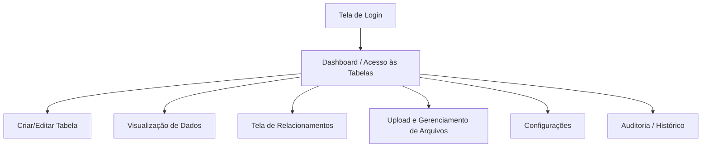

# Dama Box — Sistema de Armazenamento de Arquivos e Gerenciamento de Tabelas

Este repositório contém a especificação e o desenvolvimento do **Dama Box**, um sistema robusto e moderno para criação, estruturação e gerenciamento de tabelas dinâmicas, relacionamentos de dados e armazenamento de arquivos associados.

O objetivo do projeto é fornecer uma interface visual e intuitiva para que usuários possam modelar bancos de dados relacionais e gerenciar arquivos sem a necessidade de conhecimento aprofundado em SQL.

---

## 🗺️ Visão Geral das Telas e Funcionalidades

O sistema é composto por 8 telas principais, divididas estrategicamente para oferecer uma experiência fluida e organizada.

### 1. 🔐 Tela de Login
Responsável pela autenticação e segurança no acesso à plataforma.
* **Autenticação Segura:** Login com e-mail/usuário e senha criptografada.
* **Persistência de Sessão:** Opção "Lembrar usuário" para agilizar acessos futuros.
* **Recuperação de Acesso:** Fluxo completo de "Esqueci minha senha" com envio de token de recuperação.
* **Validação em Tempo Real:** Feedback imediato de credenciais inválidas ou campos mal formatados.
* **Integração Externa (Futuro):** Estrutura preparada para OAuth2 (Google, Microsoft, GitHub, etc.).

### 2. 📊 Tela de Acesso às Tabelas (Dashboard)
O painel central de controle do usuário pós-autenticação.
* **Listagem Dinâmica:** Visualização de todas as tabelas criadas pelo usuário.
* **Busca e Filtro:** Localização rápida de tabelas por nome, data de criação ou tags.
* **Operações Rápidas:** Criação, duplicação e exclusão de tabelas diretamente pelo painel.
* **Importação Facilitada:** Suporte para importação de estruturas existentes via arquivos CSV, JSON, etc.
* **Visualização da Estrutura:** Resumo rápido das colunas e tipos de dados antes de abrir a tabela.

### 3. 🛠️ Tela de Criar/Editar Tabela
Área dedicada à modelagem de dados de forma puramente visual.
* **Definição de Metadados:** Nomeação e descrição da tabela.
* **Gerenciamento de Colunas:** Adicionar, reordenar, editar e excluir colunas.
* **Tipagem de Dados Completa:** Suporte para Texto, Número (Inteiro/Decimal), Data/Hora, Booleano, Arquivo e mais.
* **Chaves e Restrições:**
  * Definição intuitiva de Chave Primária (PK).
  * Criação de Chaves Estrangeiras (FK) para relacionar tabelas.
  * Regras de validação: *Not Null* (obrigatório), *Unique* (único), valores padrão, etc.
* **Preview Dinâmico:** Visualização prévia da estrutura gerada antes de aplicar as alterações.

### 4. 👁️ Tela de Visualização de Dados (Tabela)
A planilha interativa onde os dados residem e são manipulados pelo usuário final.
* **Visualização Tabular:** Interface otimizada no estilo planilha para leitura rápida de registros.
* **Edição Inline:** Modificação de registros diretamente na célula correspondente com salvamento rápido.
* **Manipulação de Registros:** Inserção rápida de novas linhas e exclusão de registros selecionados.
* **Performance e Navegação:** Paginação inteligente e carregamento sob demanda (infinite scroll ou paginação clássica).
* **Filtros Avançados:** Ordenação multidirecional e buscas textuais ou numéricas avançadas por coluna.

### 5. 🔗 Tela de Relacionamentos
Uma visão esquemática e visual da integridade referencial do banco de dados.
* **Diagrama Interativo:** Visualização gráfica de tabelas como blocos interligados por linhas de relacionamento.
* **Criação Visual de Vínculos:** Arrastar e soltar para ligar chaves primárias a chaves estrangeiras.
* **Cardinalidade:** Suporte e representação clara de relações 1:1, 1:N e N:N (com tabelas intermediárias automáticas).
* **Validação de Integridade:** Prevenção ativa contra loops de relacionamento ou exclusões que quebrem a consistência dos dados.

### 6. 📁 Tela de Upload e Gerenciamento de Arquivos
O hub de arquivos integrados, permitindo anexo de mídias aos registros de dados.
* **Upload Simples e Lote:** Área de *drag and drop* para envio de imagens, PDFs, documentos de texto e planilhas.
* **Associação Direta:** Vinculação de arquivos enviados a registros específicos de tabelas do sistema.
* **Visualizador Integrado:** Pré-visualização de imagens e PDFs diretamente no navegador sem necessidade de download.
* **Controle de Cota e Formato:** Validação rígida de formatos permitidos e limite de tamanho de arquivos por upload.

### 7. ⚙️ Tela de Configurações
Central de controle de preferências pessoais e segurança.
* **Perfil do Usuário:** Atualização de dados cadastrais, e-mail e alteração segura de senha.
* **Customização de Interface:** Alternância entre temas (Claro/Escuro) e preferências de exibição de tabelas.
* **Controle de Acesso (ACL):** Se configurado para múltiplos usuários, gerenciamento de permissões de leitura/escrita para convidados.

### 8. 📜 Tela de Auditoria / Histórico (Opcional / Avançado)
A trilha de auditoria essencial para conformidade e segurança da informação.
* **Trilha de Alterações:** Log detalhado de quem inseriu, modificou ou deletou dados ou tabelas.
* **Timestamping:** Registro exato de data e hora de cada transação.
* **Rollback de Versão:** Possibilidade de reverter a estrutura de uma tabela ou o valor de um registro para uma versão anterior.

---

## 🛠️ Arquitetura Sugerida e Stack Tecnológica

Para o desenvolvimento deste sistema, recomenda-se uma arquitetura baseada em microsserviços ou uma estrutura desacoplada com Single Page Application (SPA) no frontend e uma API REST robusta no backend.

### Frontend
* **Framework:** React.js / Next.js ou Vue.js (para reatividade nas planilhas e diagramas).
* **Estilização:** Tailwind CSS (estilo moderno, responsivo e limpo) ou Componentes customizados baseados em CSS Vanilla.
* **Biblioteca de Diagramas:** React Flow ou GoJS (para a Tela de Relacionamentos).

### Backend
* **Linguagem/Framework:** Node.js (Express/NestJS) ou Python (FastAPI/Django).
* **Banco de Dados Relacional:** PostgreSQL ou MySQL (ideal para suportar a criação dinâmica de schemas e tabelas).
* **Armazenamento de Arquivos:** MinIO (local) ou AWS S3 / Google Cloud Storage (nuvem).
