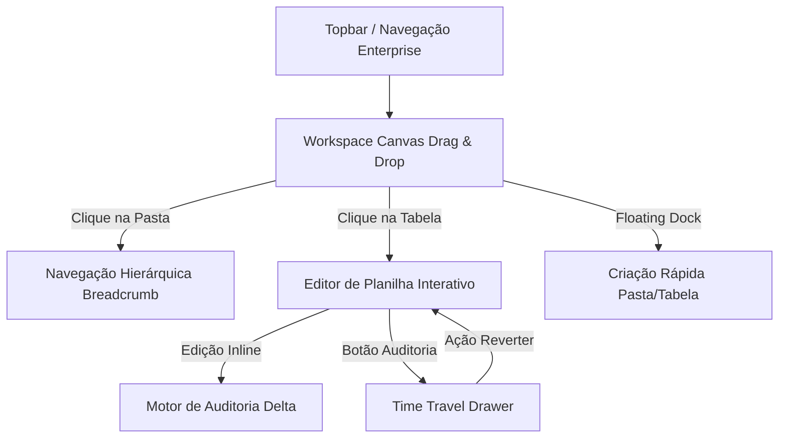

# 🎲 Dama Box Enterprise 2.0 — Sistema de Armazenamento de Arquivos e Gerenciamento de Tabelas Dinâmicas

[](https://fastapi.tiangolo.com)
[](https://react.dev)
[](https://vitejs.dev)
[](https://tailwindcss.com)
[](https://www.postgresql.org)
[]()

Este repositório contém o código-fonte e a especificação da arquitetura do **Dama Box Enterprise**, uma plataforma robusta, multi-tenant e moderna para criação, estruturação e gerenciamento de tabelas dinâmicas, relacionamentos de dados e armazenamento de arquivos associados.

O sistema combina uma **interface visual "Impeccable UI"** altamente reativa no frontend com uma arquitetura de backend corporativa baseada em **Clean Architecture**, isolamento de dados por inquilino (**Database-per-tenant**) e **Time Travel com Event Sourcing**.

---

## 🏛️ Destaques da Arquitetura & Engenharia

### 1. ⚙️ Backend Corporativo (Python & FastAPI)
- **Clean Architecture & DDD:** Separação estrita em camadas (`domain`, `application`, `infrastructure`, `presentation`).
- **Isolamento Multi-tenant (Database-per-tenant):** Cada cliente possui seu próprio schema dedicado no PostgreSQL (ou banco isolado SQLite no modo dev), garantindo segurança e segregação física/lógica dos dados.
- **Motor de Trilha Imutável (Time Travel):** Toda alteração em células de tabelas é gravada no log de eventos (`AuditLog`) como um *delta diferencial*. Permite auditar quem alterou qual campo e **reverter a planilha inteira ou células individuais para qualquer versão passada** em milissegundos.
- **Worker de Limpeza Automática:** Purga noturna de registros marcados como *soft-delete* respeitando retenção configurável e bloqueios de transações ativas.
- **Rigor TDD:** 38 testes unitários e de integração validando desde serviços de tenant até rotações e reversões temporais.

### 2. 💎 Frontend Premium ("Impeccable UI" com React 19 & Tailwind v4)
- **Glassmorphism & OKLCH Palette:** Design system construído com tokens OKLCH de alto contraste, sombreamento profundo e painéis de vidro fosco (`backdrop-blur`).
- **Workspace Canvas (Figma/Miro style):** Navegação infinita por drag-and-drop (@dnd-kit), grid pontilhado e dock flutuante reativo para ações rápidas.
- **Grid Interativo de Planilha Dinâmica:** Edição inline direta nas células com feedback imediato, tipagem forte (moeda, status, data, número) e suporte a modo offline com fallback para demonstração.
- **Time Travel Drawer:** Gaveta lateral interativa que exibe a linha do tempo de modificações com diff visual (+novo / -antigo) e ação de reversão instantânea.
- **Modo Híbrido (Online / Demo):** O cliente HTTP (`api.ts`) detecta a saúde do backend em tempo real. Se a API estiver offline, o sistema ativa o **Modo Demo**, permitindo modelar tabelas e testar todas as funcionalidades localmente sem perda de fluidez.

---

## 🚀 Guia Quick Start — Rodando o Projeto Localmente

O Dama Box foi projetado para subir rapidamente em qualquer ambiente local. Siga os passos abaixo para iniciar o Backend e o Frontend.

### Pré-requisitos
- [Node.js](https://nodejs.org/) (v18+ ou superior)
- [Python](https://www.python.org/) (v3.10+ ou superior)
- [npm](https://www.npmjs.com/) ou [pnpm](https://pnpm.io/)

---

### Passo 1: Executando o Backend (FastAPI + SQLite/PostgreSQL)

1. **Abra um terminal e navegue até a pasta do backend:**
   ```bash
   cd backend
   ```

2. **Crie e ative um ambiente virtual Python (opcional, porém recomendado):**
   ```bash
   # Windows
   python -m venv venv
   .\venv\Scripts\activate

   # Linux / macOS
   python3 -m venv venv
   source venv/bin/activate
   ```

3. **Instale as dependências do projeto:**
   ```bash
   pip install -r requirements.txt
   ```

4. **Rode as migrações do Alembic (cria os schemas multi-tenant e tabelas):**
   ```bash
   alembic upgrade head
   ```

5. **Inicie o servidor de desenvolvimento com Uvicorn:**
   ```bash
   uvicorn src.main:app --reload --port 8000
   ```
   > ✅ O backend estará rodando em **http://localhost:8000**. Você pode acessar a documentação interativa Swagger/OpenAPI em **http://localhost:8000/docs**.

---

### Passo 2: Executando o Frontend (Vite + React 19)

1. **Abra um novo terminal e navegue até a pasta do frontend:**
   ```bash
   cd frontend
   ```

2. **Instale as dependências:**
   ```bash
   npm install
   ```

3. **Inicie o servidor de desenvolvimento Vite:**
   ```bash
   npm run dev
   ```
   > ✅ O frontend estará disponível em **http://localhost:5173**. O proxy do Vite redirecionará automaticamente as chamadas de `/api` e `/health` para a porta 8000.

---

## 🧪 Validando Testes e Qualidade

### Testes do Backend (Pytest)
Para garantir que toda a lógica de Clean Architecture, isolamento multi-tenant e Time Travel está em conformidade:
```bash
cd backend
pytest -v
```
*Deverá exibir a aprovação limpa da bateria completa de testes (`38 passed`).*

### Build de Produção do Frontend
Para validar a checagem de tipos TypeScript e empacotamento otimizado:
```bash
cd frontend
npm run build
```

---

## 🗺️ Fluxo de Telas e Módulos Principais


```mermaid
graph TD
    A[Topbar / Navegação Enterprise] --> B[Workspace Canvas Drag & Drop]
    B -->|Clique na Pasta| C[Navegação Hierárquica Breadcrumb]
    B -->|Clique na Tabela| D[Editor de Planilha Interativo]
    D -->|Edição Inline| E[Motor de Auditoria Delta]
    D -->|Botão Auditoria| F[Time Travel Drawer]
    F -->|Ação Reverter| D
    B -->|Floating Dock| G[Criação Rápida Pasta/Tabela]
```

1. **Workspace:** Organize pastas e planilhas em um canvas infinito com drag-and-drop suave.
2. **Editor de Planilhas:** Adicione colunas, insira registros e edite valores diretamente no grid.
3. **Time Travel:** Clique no botão de Auditoria em qualquer linha para ver o histórico completo de mutações com carimbo de tempo, usuário e delta de alteração, podendo reverter o estado da planilha com um clique.

---

## 📄 Licença
Distribuído sob a licença MIT. Desenvolvido para modelagem e gestão de dados corporativos de alta performance.
