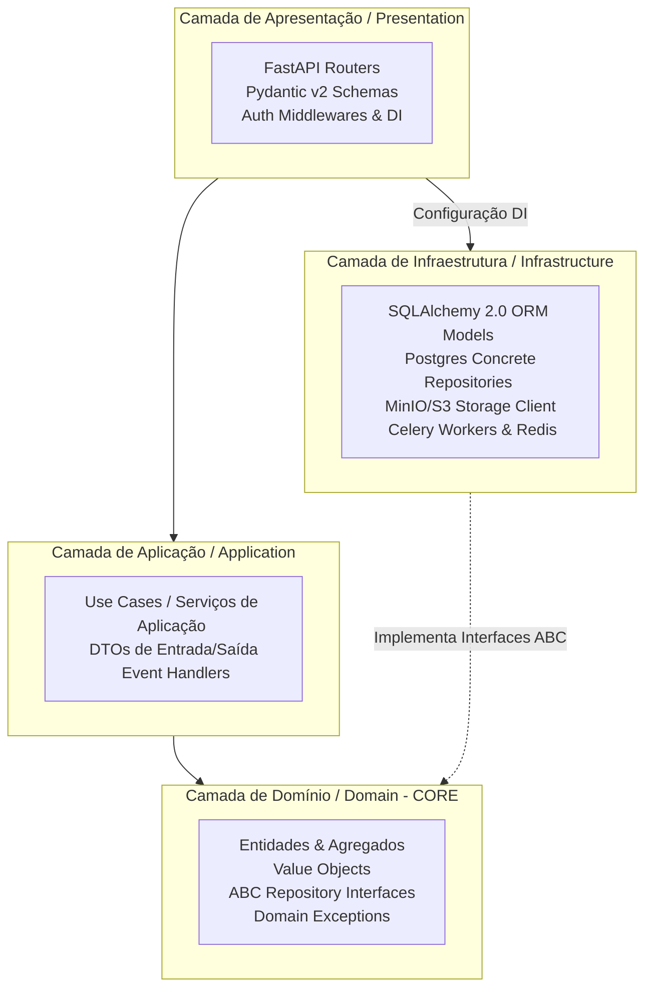

# Arquitetura do Backend e Especificação REST / OpenAPI — Dama Box

Este documento define a arquitetura estrutural do Backend em Python (**FastAPI** + **SQLAlchemy 2.0**) baseada nos preceitos da **Clean Architecture** (Arquitetura Limpa) aliada ao **Domain-Driven Design (DDD)**. Além disso, apresenta a especificação canônica da API RESTful pública/privada, padronização de tratamento de erros (**RFC 7807**) e mapeamento completo de rotas e payloads para o ecossistema do **Dama Box**.

---

## 1. Visão Geral da Arquitetura (Clean Architecture + DDD)

A arquitetura do servidor impõe a **Regra de Dependência**: o código das camadas internas (Domínio) não pode, sob nenhuma circunstância, conhecer, importar ou referenciar frameworks externos, bibliotecas web ou detalhes técnicos de infraestrutura (como SQLAlchemy ou FastAPI).



### 1.1. Estrutura Modular do Diretório `backend/app/`
Para evitar um monolito desorganizado, o projeto é particionado por **Módulos de Domínio (Bounded Contexts)** e, internamente, polido pelas 4 camadas da Clean Architecture:

```text
backend/app/
├── core/                   # Configurações globais, segurança, variáveis de ambiente (Pydantic Settings)
├── shared/                 # Componentes compartilhados (Value Objects globais, exceções base, UoW interface)
├── modules/
│   ├── iam/                # Módulo: Identidade, Autenticação, Contas e RBAC
│   │   ├── domain/         # Entidades: User, Organization, Invitation | ABCs: IUserRepository
│   │   ├── application/    # Use Cases: AuthenticateUserUseCase, SwitchTenantUseCase
│   │   ├── infrastructure/ # Repositórios: UserSQLAlchemyRepository | ORM: UserModel
│   │   └── presentation/   # FastAPI Routers: auth_router.py, users_router.py
│   │
│   ├── catalog/            # Módulo: Workspaces, Pastas, Tabelas Dinâmicas e Colunas
│   │   ├── domain/         # Entidades: Workspace, TableDefinition, ColumnDefinition
│   │   ├── application/    # Use Cases: CreateTableUseCase, EvolveSchemaUseCase
│   │   ├── infrastructure/ # Repositórios: TableSQLAlchemyRepository
│   │   └── presentation/   # FastAPI Routers: workspaces_router.py, tables_router.py
│   │
│   ├── engine/             # Módulo: Registros Dinâmicos (JSONB), Células e Anexos S3
│   │   ├── domain/         # Entidades: Record, FileAttachment | VOs: DynamicPayload
│   │   ├── application/    # Use Cases: InsertRecordUseCase, QueryDynamicRecordsUseCase
│   │   ├── infrastructure/ # GIN Index Query Builders, S3 Storage Adapters
│   │   └── presentation/   # FastAPI Routers: records_router.py, files_router.py
│   │
│   └── audit/              # Módulo: Trilha de Auditoria e Time Travel
│       ├── domain/         # Entidades: AuditLog, RecordVersion
│       ├── application/    # Use Cases: CaptureTimeTravelDiffUseCase, RollbackRecordUseCase
│       └── presentation/   # FastAPI Routers: audit_router.py, history_router.py
└── main.py                 # Ponto de entrada (Inicialização do FastAPI, CORS, Middlewares)
```

---

## 2. Padrões Técnicos em Python (FastAPI + SQLAlchemy 2.0)

### 2.1. Inversão de Dependência (DIP) e Repositórios
As regras de negócio dependem de abstrações em `domain/`, não de implementações de banco. A injeção da implementação em tempo de execução é coordenada pelo sistema de **Dependency Injection (DI)** do FastAPI:

```python
# 1. EM DOMAIN (backend/app/modules/catalog/domain/repositories.py)
from abc import ABC, abstractmethod
from uuid import UUID
from .entities import TableDefinition

class ITableRepository(ABC):
    @abstractmethod
    async def get_by_id(self, table_id: UUID) -> TableDefinition | None: ...
    @abstractmethod
    async def save(self, table: TableDefinition) -> None: ...

# 2. EM INFRASTRUCTURE (backend/app/modules/catalog/infrastructure/repositories.py)
from sqlalchemy.ext.asyncio import AsyncSession
from sqlalchemy import select
from ..domain.repositories import ITableRepository
from ..domain.entities import TableDefinition
from .orm_models import TableDefinitionModel

class TableSQLAlchemyRepository(ITableRepository):
    def __init__(self, session: AsyncSession):
        self._session = session

    async def get_by_id(self, table_id: UUID) -> TableDefinition | None:
        stmt = select(TableDefinitionModel).where(TableDefinitionModel.id == table_id, TableDefinitionModel.is_deleted == False)
        result = await self._session.execute(stmt)
        model = result.scalar_one_or_none()
        return model.to_entity() if model else None

    async def save(self, table: TableDefinition) -> None:
        model = TableDefinitionModel.from_entity(table)
        self._session.add(model)
        await self._session.flush()
```

### 2.2. Gerenciamento Transacional (Unit of Work Pattern)
Para garantir **atomicidade** em operações complexas (ex: criar uma Tabela, 5 Colunas e gerar 1 log de auditoria), a camada de aplicação utiliza uma interface `IUnitOfWork` assíncrona:

```python
# EM APPLICATION (backend/app/modules/catalog/application/use_cases.py)
class CreateTableUseCase:
    def __init__(self, uow: IUnitOfWork):
        self.uow = uow

    async def execute(self, workspace_id: UUID, name: str, actor_id: UUID) -> TableDefinitionDTO:
        async with self.uow:
            # Todas as operações dentro do bloco compartilham a mesma sessão transacional do Postgres
            workspace = await self.uow.workspaces.get_by_id(workspace_id)
            if not workspace:
                raise WorkspaceNotFoundException(workspace_id)

            table = TableDefinition(workspace_id=workspace_id, name=name, created_by=actor_id)
            await self.uow.tables.save(table)
            
            # Commit automático ao sair do contexto sem exceção
            await self.uow.commit()
            return TableDefinitionDTO.from_entity(table)
```

---

## 3. Padrão Universal de Erros (RFC 7807 — Problem Details)

O Dama Box **proíbe** retornos de erro genéricos em texto puro ou JSONs disformes. Todos os erros HTTP gerados pela API (validações Pydantic, falhas de segurança ou exceções de domínio) devem seguir a especificação **IETF RFC 7807 (Problem Details for HTTP APIs)**.

### 3.1. Estrutura Canônica do JSON de Erro
```json
{
  "type": "https://api.damabox.com/errors/incompatible-type-cast",
  "title": "Falha na Conversão de Tipo de Coluna",
  "status": 409,
  "detail": "Não é possível alterar a coluna 'Código do Produto' de 'Text' para 'Integer' pois existem 14 registros com valores não numéricos no banco de dados.",
  "instance": "/api/v1/tables/tbl_01h87/columns/col_9988",
  "code": "DAMABOX-ERR-40912",
  "invalid_params": [
    {
      "name": "data_type",
      "reason": "Valor 'Integer' incompatível com dados materializados pré-existentes."
    }
  ],
  "timestamp": "2026-07-07T19:47:00.123Z"
}
```

### 3.2. Mapeamento de Códigos HTTP de Retorno
| Código HTTP | Significado Padrão na API Dama Box | Exemplo de Cenário |
| :---: | :--- | :--- |
| **`400`** | `Bad Request` | Falha na validação sintática do JSON ou UUID mal formatado. |
| **`401`** | `Unauthorized` | Token JWT ausente, expirado ou falha no hash Argon2id. |
| **`403`** | `Forbidden` | Usuário autenticado, mas sem autorização RBAC ou bloqueado pela ACL Granular. |
| **`404`** | `Not Found` | Recurso não existe no banco da empresa ativa ou foi enviado para a Lixeira. |
| **`409`** | `Conflict` | Tentativa de criar Workspace com nome já existente no Tenant ou conflito de schema. |
| **`422`** | `Unprocessable Entity` | Erro de validação semântica do Pydantic v2 (ex: número decimal negativo para preço). |
| **`429`** | `Too Many Requests` | Rate limit excedido (ex: > 60 tentativas de login por minuto no mesmo IP). |
| **`500`** | `Internal Server Error` | Exceção não tratada na infraestrutura (queda de conexão com AWS RDS / S3). |

---

## 4. Especificação de Endpoints REST / OpenAPI (Swagger)

A API baseia-se no prefixo oficial `/api/v1`. Todas as requisições (exceto login/refresh) exigem o cabeçalho `Authorization: Bearer <jwt>`.

### 4.1. Catálogo de Endpoints Core

| Módulo | Método | Rota HTTP | Descrição do Endpoint | Acesso Requerido | Rate Limit |
| :--- | :---: | :--- | :--- | :---: | :---: |
| **Auth** | `POST` | `/api/v1/auth/login` | Autenticação com credenciais e emissão de JWT + Cookie HttpOnly. | Público | 60 / min |
| | `POST` | `/api/v1/auth/refresh` | Rotação e renovação do token via Cookie de sessão. | Cookie Válido | 30 / min |
| | `POST` | `/api/v1/auth/switch-tenant`| Troca de empresa ativa (re-emissão do JWT escopado). | JWT Válido | 30 / min |
| **Catalog**| `GET` | `/api/v1/workspaces` | Lista todos os Workspaces ativos da organização do usuário. | RBAC / ACL | 120 / min |
| | `POST` | `/api/v1/workspaces` | Cria um novo Workspace dentro do limite de 100 da empresa. | `Owner`/`Admin`/`Member`| 30 / min |
| | `POST` | `/api/v1/workspaces/{id}/tables`| Cria uma nova Tabela Dinâmica com metadados iniciais. | `table:create` | 30 / min |
| | `POST` | `/api/v1/tables/{id}/columns` | Adiciona ou edita uma definição de coluna na tabela. | `table:alter_schema`| 30 / min |
| **Engine** | `GET` | `/api/v1/tables/{id}/records` | Consulta paginada de planilhas com filtros GIN otimizados em JSONB.| `data:view` | 300 / min |
| | `POST` | `/api/v1/tables/{id}/records` | Inserção de uma ou mais linhas/células na planilha interativa. | `data:insert` | 120 / min |
| | `PATCH`| `/api/v1/records/{rid}/cells` | Edição inline de célula única na planilha (gera log Time Travel). | `data:update` | 600 / min |
| | `POST` | `/api/v1/records/{rid}/files` | Upload de anexo em `multipart/form-data` para o AWS S3 / MinIO. | `file:upload` | 30 / min |
| **Audit** | `GET` | `/api/v1/records/{rid}/history`| Retorna a linha do tempo cronológica de edições (Time Travel). | `data:view` | 120 / min |

---

### 4.2. Payloads Detalhados de Exemplos Canônicos

#### 1. Consulta Dinâmica de Registros (com Paginação e Filtros GIN)
*   **Requisição:** `GET /api/v1/tables/tbl_01h87g/records?page=1&size=50&sort_col=col_price&sort_dir=desc&filter_col_cat=Hardware`
*   **Resposta (200 OK):**
    ```json
    {
      "table_id": "tbl_01h87g",
      "pagination": {
        "current_page": 1,
        "page_size": 50,
        "total_records": 1420,
        "total_pages": 29
      },
      "columns_metadata": [
        { "id": "col_name", "name": "Nome do Produto", "data_type": "Text" },
        { "id": "col_price", "name": "Preço Unitário", "data_type": "Decimal" },
        { "id": "col_cat", "name": "Categoria", "data_type": "Select" }
      ],
      "records": [
        {
          "record_id": "rec_998877",
          "created_by": "usr_112233",
          "updated_at": "2026-07-07T19:40:00Z",
          "cells": {
            "col_name": "MacBook Pro M3 Max",
            "col_price": 24500.00,
            "col_cat": "Hardware"
          }
        }
      ]
    }
    ```

#### 2. Edição Inline de Célula (Acionando Versionamento Time Travel)
*   **Requisição:** `PATCH /api/v1/records/rec_998877/cells`
*   **Headers:** `Authorization: Bearer <jwt>`, `Content-Type: application/json`
*   **Payload (JSON):**
    ```json
    {
      "column_id": "col_price",
      "new_value": 22900.00,
      "reason_note": "Ajuste promocional de julho"
    }
    ```
*   **Resposta (200 OK):**
    ```json
    {
      "record_id": "rec_998877",
      "updated_at": "2026-07-07T19:47:15.890Z",
      "cell_modified": {
        "column_id": "col_price",
        "old_value": 24500.00,
        "new_value": 22900.00
      },
      "time_travel_version_id": "ver_01j23k4l5m6n7p8q9r"
    }
    ```
