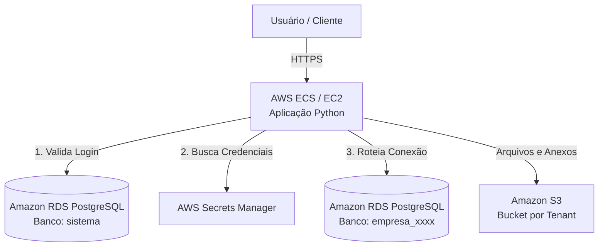

# Arquitetura Multi-Tenancy: Isolamento por Banco de Dados (Database-per-Tenant)

Este documento especifica a estratégia de isolamento físico de dados da plataforma **Dama Box**, utilizando uma abordagem de **múltiplos bancos de dados dinâmicos** gerenciados por uma única instância do PostgreSQL no AWS RDS.

---

## 1. Visão Geral da Infraestrutura AWS

A infraestrutura utiliza serviços gerenciados da AWS para garantir segurança, escalabilidade e isolamento.



### Componentes:
*   **AWS ECS / EC2:** Hospeda o Backend em Python (FastAPI).
*   **Amazon S3:** Armazenamento de arquivos e mídias anexadas aos registros, com subpastas ou buckets isolados por ID da empresa.
*   **AWS Secrets Manager:** Armazena com segurança as credenciais mestras do PostgreSQL e chaves de criptografia.
*   **Amazon RDS PostgreSQL:** Instância única de banco de dados rodando múltiplos bancos lógicos.

---

## 2. Estrutura do Servidor de Banco de Dados (PostgreSQL)

O servidor de banco de dados é dividido em duas categorias de escopo:

```text
Amazon RDS PostgreSQL (Instância Única)
├── Banco Administrativo: "sistema"
│   ├── users (Dados de autenticação globais)
│   └── companies (Mapeamento de conexão dos Tenants)
│
├── Banco do Tenant A: "empresa_0001"
│   ├── tabelas, chaves (PK/FK), índices
│   └── dados isolados do cliente A
│
├── Banco do Tenant B: "empresa_0002"
│   ├── tabelas, chaves (PK/FK), índices
│   └── dados isolados do cliente B
│
└── Banco do Tenant N: "empresa_N"
    └── dados isolados do cliente N
```

### 2.1. Banco Administrativo (`sistema`)
Armazena dados globais, metadados de contas e informações necessárias para rotear o usuário para o banco correto pós-autenticação.

#### Tabela: `users`
Contém credenciais de login e o identificador da empresa à qual o usuário pertence.

```sql
CREATE TABLE users (
    id UUID PRIMARY KEY DEFAULT gen_random_uuid(),
    email VARCHAR(255) UNIQUE NOT NULL,
    username VARCHAR(50) UNIQUE NOT NULL,
    password_hash VARCHAR(255) NOT NULL,
    company_id INTEGER NOT NULL REFERENCES companies(id),
    active BOOLEAN DEFAULT TRUE,
    created_at TIMESTAMPTZ DEFAULT CURRENT_TIMESTAMP
);
```

#### Tabela: `companies`
Mapeia cada tenant ao seu banco de dados específico e fornece as coordenadas de rede e credenciais para conexão.

```sql
CREATE TABLE companies (
    id SERIAL PRIMARY KEY,
    company_name VARCHAR(100) NOT NULL,
    database_name VARCHAR(50) UNIQUE NOT NULL,
    database_host VARCHAR(255) NOT NULL,
    database_port INTEGER DEFAULT 5432,
    database_user VARCHAR(50) NOT NULL,
    database_password VARCHAR(255) NOT NULL
);
```

### 2.2. Bancos de Clientes (`empresa_xxxx`)
Bancos de dados isolados criados dinamicamente para cada nova empresa registrada.
*   **Isolamento Físico:** Sem compartilhamento de tabelas ou memória em nível de consulta com outros clientes.
*   **Customização Livre:** Cada cliente possui suas próprias definições de tabelas, chaves estrangeiras, índices, views e triggers.

---

## 3. Fluxo de Login e Roteamento Dinâmico de Conexão

O processo de autenticação e abertura de conexão segura segue o fluxo estruturado abaixo:

```mermaid
sequenceDiagram
    autonumber
    actor User as Usuário
    participant App as App Python (Backend)
    database DbAdmin as Banco "sistema"
    database DbTenant as Banco "empresa_xxxx"

    User->>App: Submete Email e Senha
    App->>DbAdmin: Consulta users (Email)
    DbAdmin-->>App: Retorna hash e company_id (Ex: 15)
    App->>App: Valida Senha (BCrypt/Argon2)
    App->>DbAdmin: Consulta companies (id = 15)
    DbAdmin-->>App: Retorna database_name (empresa_0015) e credenciais
    App->>App: Cria Pool/Conexão Sob Demanda (empresa_0015)
    App->>DbTenant: Executa SQL (Ex: SELECT * FROM produtos)
    DbTenant-->>App: Retorna Dados
    App-->>User: Exibe Dados na Tela
```

### Mecanismo de Roteamento em Python (Backend)
Para evitar o overhead de criar conexões do zero em cada requisição HTTP, a aplicação Python implementa um **Dynamic Connection Router**:

1.  **Dicionário de Conexões (Cache de Pools):** O Backend mantém na memória um dicionário ou cache de pools de conexões (`dict[str, QueuePool]`).
2.  **Middleware de Roteamento:** A cada requisição, um Middleware intercepta o token JWT do usuário, extrai a `company_id` e busca o pool correspondente no cache.
3.  **Fallback de Inicialização:** Se o pool do cliente não existir no cache (ex: primeiro acesso após reinicialização do servidor), o middleware consulta o banco `sistema`, lê as credenciais, inicializa o pool e o adiciona ao cache para requisições subsequentes.
