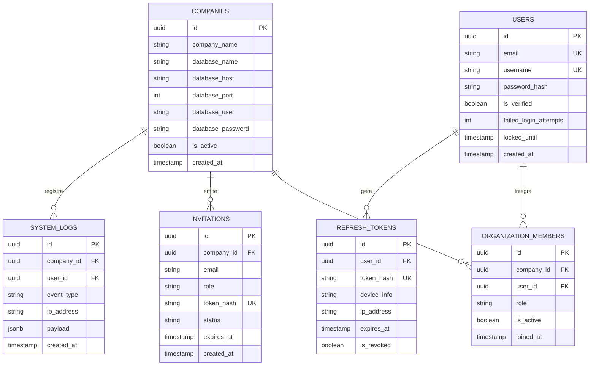
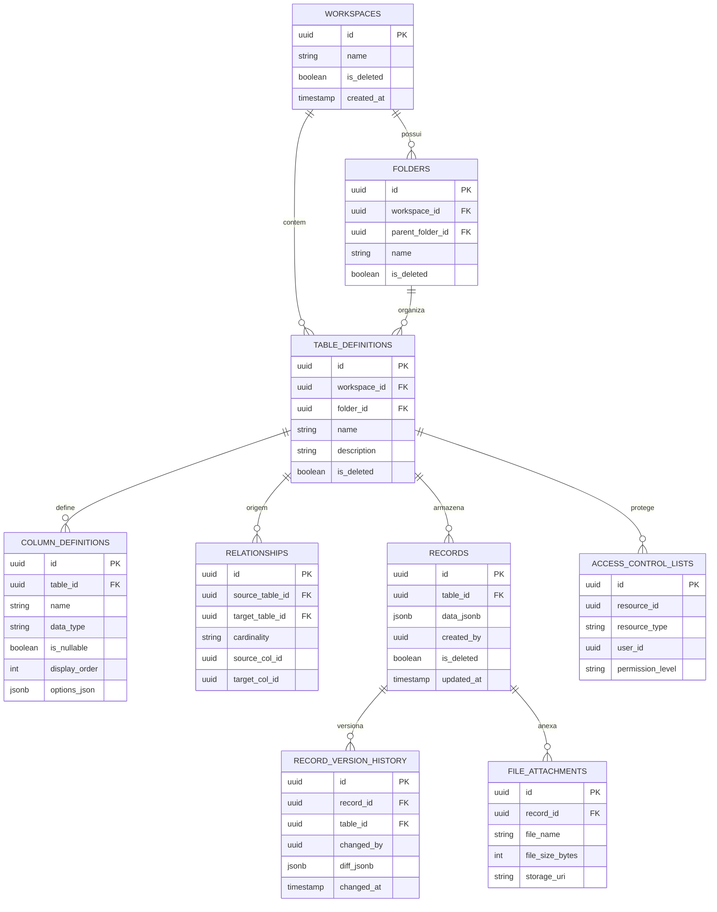

# Diagrama ER Completo e DDL PostgreSQL — Dama Box

Este documento especifica a modelagem física de dados relacional e híbrida (JSONB) para o banco de dados **PostgreSQL** da plataforma **Dama Box**. Conforme a Arquitetura Multi-Tenancy definida, o sistema divide o armazenamento físico em dois escopos distintos: o **Banco Administrativo (`sistema`)** e os **Bancos de Clientes (`empresa_XXXX`)**.

---

## 1. Diretrizes de Engenharia de Banco de Dados

1. **Chaves Primárias Universais (`UUIDv7`):** Todas as entidades utilizam `UUIDv7` como chave primária (`PK`). Diferente do UUIDv4 aleatório, o UUIDv7 preserva a ordenação temporal sequencial (milissegundos no cabeçalho), eliminando a fragmentação de páginas de índices B-Tree no PostgreSQL e mantendo a performance de chaves numéricas auto-incrementais.
2. **Isolamento de Contas e Papéis (RBAC Global):** Para permitir que um profissional (ex: consultor ou gestor) acesse múltiplas empresas com um único e-mail de login, a identidade global (`users`) é estritamente separada do vínculo de acesso com a empresa (`organization_members`).
3. **Performance Híbrida em Dados Dinâmicos:** A tabela de registros operacionais (`records`) adota o tipo nativo `JSONB` para armazenar colunas dinâmicas criadas em tempo de execução pelos usuários, indexada por **GIN (Generalized Inverted Index)** para buscas textuais e numéricas em milissegundos.
4. **Soft Delete e Trilha Temporal:** A exclusão física imediata é proibida nas tabelas operacionais e estruturais. A cláusula `is_deleted = FALSE` deve ser incorporada nos índices e consultas.

---

## 2. Banco Administrativo (`sistema`)

O banco `sistema` atua como o catálogo mestre de roteamento, autenticação global e controle de planos da plataforma.

### 2.1. Diagrama ER — Banco Administrativo



### 2.2. Scripts DDL — Banco Administrativo (`sistema`)

> **Nota para execução no DBeaver / PostgreSQL:** Execute este script conectado ao banco mestre `sistema`.

```sql
-- Habilitar extensões necessárias
CREATE EXTENSION IF NOT EXISTS "pgcrypto";

-- Enum de Cargos Organizacionais (RBAC)
CREATE TYPE org_role_enum AS ENUM ('Owner', 'Admin', 'Member', 'Guest');
CREATE TYPE invitation_status_enum AS ENUM ('Pending', 'Accepted', 'Rejected', 'Cancelled', 'Expired');

-- 1. Tabela de Empresas (Tenants)
CREATE TABLE companies (
    id UUID PRIMARY KEY, -- Preenchido via UUIDv7 na aplicação ou função PG
    company_name VARCHAR(150) NOT NULL,
    database_name VARCHAR(63) UNIQUE NOT NULL, -- Ex: empresa_0001 (limite do PG é 63 caracteres)
    database_host VARCHAR(255) NOT NULL,
    database_port INTEGER NOT NULL DEFAULT 5432,
    database_user VARCHAR(63) NOT NULL,
    database_password VARCHAR(255) NOT NULL,
    is_active BOOLEAN NOT NULL DEFAULT TRUE,
    created_at TIMESTAMPTZ NOT NULL DEFAULT CURRENT_TIMESTAMP,
    updated_at TIMESTAMPTZ NOT NULL DEFAULT CURRENT_TIMESTAMP
);

-- 2. Tabela de Usuários Globais
CREATE TABLE users (
    id UUID PRIMARY KEY,
    email VARCHAR(255) UNIQUE NOT NULL,
    username VARCHAR(63) UNIQUE NOT NULL,
    password_hash VARCHAR(255) NOT NULL,
    is_verified BOOLEAN NOT NULL DEFAULT FALSE,
    failed_login_attempts SMALLINT NOT NULL DEFAULT 0,
    locked_until TIMESTAMPTZ NULL DEFAULT NULL,
    created_at TIMESTAMPTZ NOT NULL DEFAULT CURRENT_TIMESTAMP,
    updated_at TIMESTAMPTZ NOT NULL DEFAULT CURRENT_TIMESTAMP
);
CREATE INDEX idx_users_email_lower ON users (LOWER(email));

-- 3. Tabela de Vínculo: Membros da Organização (RBAC)
CREATE TABLE organization_members (
    id UUID PRIMARY KEY,
    company_id UUID NOT NULL REFERENCES companies(id) ON DELETE CASCADE,
    user_id UUID NOT NULL REFERENCES users(id) ON DELETE CASCADE,
    role org_role_enum NOT NULL DEFAULT 'Member',
    is_active BOOLEAN NOT NULL DEFAULT TRUE,
    joined_at TIMESTAMPTZ NOT NULL DEFAULT CURRENT_TIMESTAMP,
    CONSTRAINT uq_company_user UNIQUE (company_id, user_id)
);
CREATE INDEX idx_org_members_user ON organization_members (user_id);
CREATE INDEX idx_org_members_company ON organization_members (company_id);

-- 4. Tabela de Convites Pendentes
CREATE TABLE invitations (
    id UUID PRIMARY KEY,
    company_id UUID NOT NULL REFERENCES companies(id) ON DELETE CASCADE,
    email VARCHAR(255) NOT NULL,
    role org_role_enum NOT NULL DEFAULT 'Member',
    token_hash VARCHAR(255) UNIQUE NOT NULL,
    status invitation_status_enum NOT NULL DEFAULT 'Pending',
    expires_at TIMESTAMPTZ NOT NULL,
    created_by UUID REFERENCES users(id) ON DELETE SET NULL,
    created_at TIMESTAMPTZ NOT NULL DEFAULT CURRENT_TIMESTAMP
);
CREATE INDEX idx_invitations_email_status ON invitations (LOWER(email), status);

-- 5. Tabela de Refresh Tokens de Segurança
CREATE TABLE refresh_tokens (
    id UUID PRIMARY KEY,
    user_id UUID NOT NULL REFERENCES users(id) ON DELETE CASCADE,
    token_hash VARCHAR(255) UNIQUE NOT NULL,
    device_info VARCHAR(255) NULL,
    ip_address VARCHAR(45) NULL, -- Suporta IPv4 e IPv6
    expires_at TIMESTAMPTZ NOT NULL,
    is_revoked BOOLEAN NOT NULL DEFAULT FALSE,
    created_at TIMESTAMPTZ NOT NULL DEFAULT CURRENT_TIMESTAMP
);
CREATE INDEX idx_refresh_tokens_user ON refresh_tokens (user_id) WHERE is_revoked = FALSE;

-- 6. Logs de Auditoria Global do Sistema
CREATE TABLE system_logs (
    id UUID PRIMARY KEY,
    company_id UUID NULL REFERENCES companies(id) ON DELETE SET NULL,
    user_id UUID NULL REFERENCES users(id) ON DELETE SET NULL,
    event_type VARCHAR(100) NOT NULL,
    ip_address VARCHAR(45) NULL,
    payload JSONB NULL,
    created_at TIMESTAMPTZ NOT NULL DEFAULT CURRENT_TIMESTAMP
);
CREATE INDEX idx_system_logs_created_at ON system_logs (created_at DESC);
CREATE INDEX idx_system_logs_company ON system_logs (company_id);
```

---

## 3. Banco do Cliente (`empresa_XXXX`)

Cada tenant possui seu banco de dados dedicado com a estrutura descrita abaixo. Nenhuma tabela deste banco requer a coluna `company_id`, pois o próprio isolamento físico do banco garante o limite do cliente.

### 3.1. Diagrama ER — Banco do Cliente



### 3.2. Scripts DDL — Banco do Cliente (`empresa_XXXX`)

> **Nota para execução no DBeaver / PostgreSQL:** Execute este script ao inicializar um novo banco de dados de cliente (`empresa_0001`, `empresa_0002`, etc.).

```sql
-- Enumerações de Domínio do Tenant
CREATE TYPE column_data_type_enum AS ENUM ('Text', 'Integer', 'Decimal', 'Boolean', 'Date', 'DateTime', 'File', 'Relation', 'Select', 'MultiSelect');
CREATE TYPE cardinality_enum AS ENUM ('ONE_TO_ONE', 'ONE_TO_MANY', 'MANY_TO_MANY');
CREATE TYPE acl_permission_enum AS ENUM ('VIEWER', 'EDITOR', 'MANAGER', 'DENY_ACCESS');
CREATE TYPE acl_resource_type_enum AS ENUM ('WORKSPACE', 'FOLDER', 'TABLE');

-- 1. Tabela de Workspaces (Áreas de Trabalho)
CREATE TABLE workspaces (
    id UUID PRIMARY KEY,
    name VARCHAR(100) NOT NULL,
    color_hex VARCHAR(7) DEFAULT '#3B82F6',
    icon_name VARCHAR(50) DEFAULT 'folder',
    created_by UUID NOT NULL, -- ID global do usuário vindo de sistema.users
    is_deleted BOOLEAN NOT NULL DEFAULT FALSE,
    deleted_at TIMESTAMPTZ NULL DEFAULT NULL,
    created_at TIMESTAMPTZ NOT NULL DEFAULT CURRENT_TIMESTAMP,
    updated_at TIMESTAMPTZ NOT NULL DEFAULT CURRENT_TIMESTAMP,
    CONSTRAINT uq_workspace_name UNIQUE (name, deleted_at)
);
CREATE INDEX idx_workspaces_active ON workspaces (is_deleted) WHERE is_deleted = FALSE;

-- 2. Tabela de Pastas (Hierarquia Recursiva)
CREATE TABLE folders (
    id UUID PRIMARY KEY,
    workspace_id UUID NOT NULL REFERENCES workspaces(id) ON DELETE CASCADE,
    parent_folder_id UUID NULL REFERENCES folders(id) ON DELETE CASCADE, -- Auto-referência
    name VARCHAR(100) NOT NULL,
    created_by UUID NOT NULL,
    is_deleted BOOLEAN NOT NULL DEFAULT FALSE,
    deleted_at TIMESTAMPTZ NULL DEFAULT NULL,
    created_at TIMESTAMPTZ NOT NULL DEFAULT CURRENT_TIMESTAMP,
    updated_at TIMESTAMPTZ NOT NULL DEFAULT CURRENT_TIMESTAMP
);
CREATE INDEX idx_folders_workspace ON folders (workspace_id) WHERE is_deleted = FALSE;
CREATE INDEX idx_folders_parent ON folders (parent_folder_id) WHERE is_deleted = FALSE;

-- 3. Tabela de Definição de Tabelas Dinâmicas (Datasets / Core Domain)
CREATE TABLE table_definitions (
    id UUID PRIMARY KEY,
    workspace_id UUID NOT NULL REFERENCES workspaces(id) ON DELETE CASCADE,
    folder_id UUID NULL REFERENCES folders(id) ON DELETE SET NULL,
    name VARCHAR(150) NOT NULL,
    description TEXT NULL,
    created_by UUID NOT NULL,
    is_deleted BOOLEAN NOT NULL DEFAULT FALSE,
    deleted_at TIMESTAMPTZ NULL DEFAULT NULL,
    created_at TIMESTAMPTZ NOT NULL DEFAULT CURRENT_TIMESTAMP,
    updated_at TIMESTAMPTZ NOT NULL DEFAULT CURRENT_TIMESTAMP
);
CREATE INDEX idx_table_defs_workspace ON table_definitions (workspace_id) WHERE is_deleted = FALSE;
CREATE INDEX idx_table_defs_folder ON table_definitions (folder_id) WHERE is_deleted = FALSE;

-- 4. Tabela de Definição de Colunas (Tipagem e Esquema)
CREATE TABLE column_definitions (
    id UUID PRIMARY KEY,
    table_id UUID NOT NULL REFERENCES table_definitions(id) ON DELETE CASCADE,
    name VARCHAR(100) NOT NULL,
    data_type column_data_type_enum NOT NULL DEFAULT 'Text',
    is_nullable BOOLEAN NOT NULL DEFAULT TRUE,
    default_value_text TEXT NULL,
    display_order SMALLINT NOT NULL DEFAULT 0,
    options_json JSONB NULL DEFAULT '{}', -- Para Select/MultiSelect (ex: {"tags": ["Urgente", "Normal"]})
    created_at TIMESTAMPTZ NOT NULL DEFAULT CURRENT_TIMESTAMP,
    updated_at TIMESTAMPTZ NOT NULL DEFAULT CURRENT_TIMESTAMP,
    CONSTRAINT uq_column_name_per_table UNIQUE (table_id, name)
);
CREATE INDEX idx_col_defs_table_order ON column_definitions (table_id, display_order ASC);

-- 5. Tabela de Relacionamentos (Integridade Referencial entre Tabelas Dinâmicas)
CREATE TABLE relationships (
    id UUID PRIMARY KEY,
    source_table_id UUID NOT NULL REFERENCES table_definitions(id) ON DELETE CASCADE,
    target_table_id UUID NOT NULL REFERENCES table_definitions(id) ON DELETE CASCADE,
    cardinality cardinality_enum NOT NULL DEFAULT 'ONE_TO_MANY',
    source_col_id UUID NOT NULL REFERENCES column_definitions(id) ON DELETE CASCADE,
    target_col_id UUID NOT NULL REFERENCES column_definitions(id) ON DELETE CASCADE,
    created_at TIMESTAMPTZ NOT NULL DEFAULT CURRENT_TIMESTAMP,
    CONSTRAINT chk_different_tables CHECK (source_table_id <> target_table_id)
);
CREATE INDEX idx_rel_source ON relationships (source_table_id);
CREATE INDEX idx_rel_target ON relationships (target_table_id);

-- 6. Tabela de Registros Operacionais (Planilha Dinâmica em JSONB)
CREATE TABLE records (
    id UUID PRIMARY KEY,
    table_id UUID NOT NULL REFERENCES table_definitions(id) ON DELETE CASCADE,
    data_jsonb JSONB NOT NULL DEFAULT '{}', -- Ex: {"col_id_1": "Notebook Dell", "col_id_2": 4500.00, "col_id_3": true}
    created_by UUID NOT NULL,
    updated_by UUID NOT NULL,
    is_deleted BOOLEAN NOT NULL DEFAULT FALSE,
    deleted_at TIMESTAMPTZ NULL DEFAULT NULL,
    created_at TIMESTAMPTZ NOT NULL DEFAULT CURRENT_TIMESTAMP,
    updated_at TIMESTAMPTZ NOT NULL DEFAULT CURRENT_TIMESTAMP
);
-- ÍNDICE GIN DE ALTA PERFORMANCE PARA BUSCAS EM CÉLULAS JSONB
CREATE INDEX idx_records_jsonb_data ON records USING GIN (data_jsonb jsonb_path_ops);
CREATE INDEX idx_records_table_active ON records (table_id) WHERE is_deleted = FALSE;

-- 7. Tabela de Versionamento e Histórico (Time Travel)
CREATE TABLE record_version_history (
    id UUID PRIMARY KEY,
    record_id UUID NOT NULL REFERENCES records(id) ON DELETE CASCADE,
    table_id UUID NOT NULL REFERENCES table_definitions(id) ON DELETE CASCADE,
    changed_by UUID NOT NULL,
    old_data_jsonb JSONB NOT NULL,
    new_data_jsonb JSONB NOT NULL,
    changed_at TIMESTAMPTZ NOT NULL DEFAULT CURRENT_TIMESTAMP
);
CREATE INDEX idx_version_history_record ON record_version_history (record_id, changed_at DESC);
CREATE INDEX idx_version_history_table ON record_version_history (table_id);

-- 8. Tabela de Anexos e Arquivos (AWS S3 / MinIO)
CREATE TABLE file_attachments (
    id UUID PRIMARY KEY,
    record_id UUID NOT NULL REFERENCES records(id) ON DELETE CASCADE,
    table_id UUID NOT NULL REFERENCES table_definitions(id) ON DELETE CASCADE,
    column_id UUID NOT NULL REFERENCES column_definitions(id) ON DELETE CASCADE,
    file_name VARCHAR(255) NOT NULL,
    file_size_bytes BIGINT NOT NULL,
    mime_type VARCHAR(100) NOT NULL,
    storage_uri VARCHAR(512) NOT NULL, -- Ex: s3://damabox-tenant-0001/tbl_xxx/rec_yyy/file.pdf
    uploaded_by UUID NOT NULL,
    uploaded_at TIMESTAMPTZ NOT NULL DEFAULT CURRENT_TIMESTAMP
);
CREATE INDEX idx_files_record ON file_attachments (record_id);
CREATE INDEX idx_files_table ON file_attachments (table_id);

-- 9. Listas de Controle de Acesso Granular (ACL)
CREATE TABLE access_control_lists (
    id UUID PRIMARY KEY,
    resource_id UUID NOT NULL, -- Pode ser ID de Workspace, Folder ou TableDefinition
    resource_type acl_resource_type_enum NOT NULL,
    user_id UUID NOT NULL,
    permission_level acl_permission_enum NOT NULL,
    granted_by UUID NOT NULL,
    granted_at TIMESTAMPTZ NOT NULL DEFAULT CURRENT_TIMESTAMP,
    CONSTRAINT uq_acl_resource_user UNIQUE (resource_id, resource_type, user_id)
);
CREATE INDEX idx_acl_user_resource ON access_control_lists (user_id, resource_type);
CREATE INDEX idx_acl_resource_id ON access_control_lists (resource_id);

-- 10. Trilha de Auditoria do Tenant (Imutável Append-Only)
CREATE TABLE tenant_audit_logs (
    id UUID PRIMARY KEY,
    event_type VARCHAR(100) NOT NULL,
    actor_id UUID NOT NULL,
    resource_type VARCHAR(50) NOT NULL,
    resource_id UUID NULL,
    payload_jsonb JSONB NULL,
    ip_address VARCHAR(45) NULL,
    created_at TIMESTAMPTZ NOT NULL DEFAULT CURRENT_TIMESTAMP
);
CREATE INDEX idx_tenant_audit_created ON tenant_audit_logs (created_at DESC);
CREATE INDEX idx_tenant_audit_actor ON tenant_audit_logs (actor_id);
```

---

## 4. Estratégia de Consultas e Otimização GIN no JSONB

A escolha do tipo `JSONB` na coluna `data_jsonb` da tabela `records` permite que uma única consulta SQL filtre, ordene e agregue dados arbitrários sem a necessidade de alterar a estrutura física da tabela relacional (`ALTER TABLE`).

### Exemplo de Consulta Otimizada usando Índice GIN
Para buscar todos os registros em uma tabela de *Estoque* onde a coluna dinâmica *"Categoria"* (cujo ID no catálogo é `col_998877`) seja igual a *"Hardware"*:

```sql
-- A cláusula @> utiliza o índice GIN (idx_records_jsonb_data) com máxima performance
SELECT id, data_jsonb, updated_at
FROM records
WHERE table_id = 'tbl_01h87g6f5e4d3c2b1a0'
  AND is_deleted = FALSE
  AND data_jsonb @> '{"col_998877": "Hardware"}';
```
