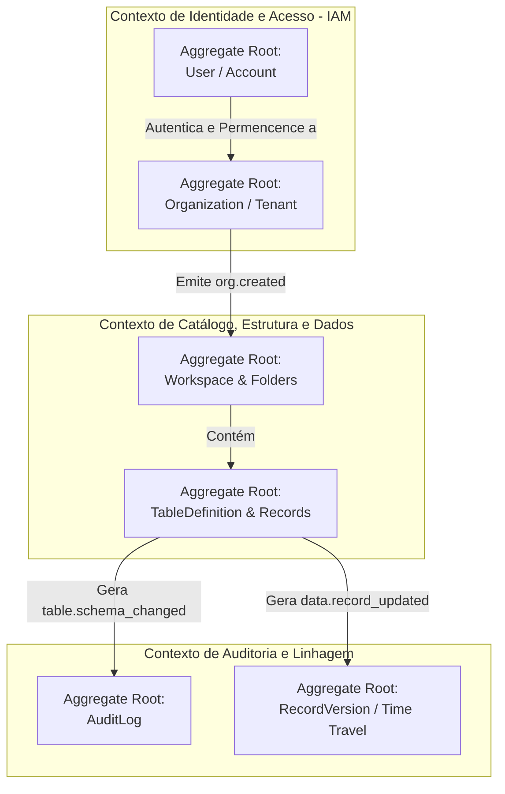
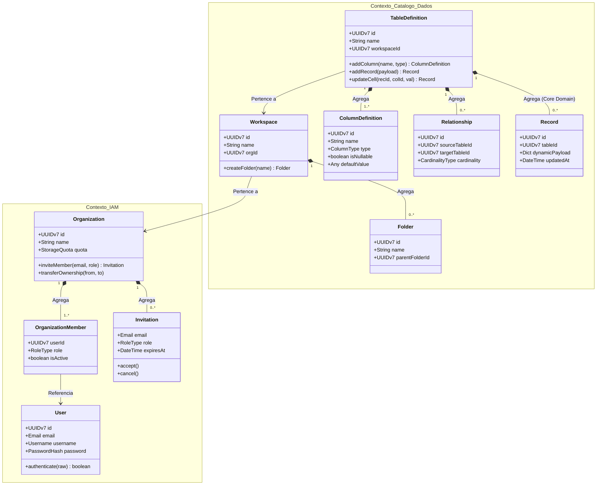

# Modelo de Domínio (DDD) — Dama Box

Este documento define a arquitetura orientada ao domínio (**Domain-Driven Design - DDD**) da plataforma **Dama Box**. Ele estabelece o Design Estratégico (Mapa de Contextos / Bounded Contexts) e o Design Tático (Agregados, Entidades, Objetos de Valor, Invariantes e Eventos de Domínio), servindo de base direta para a modelagem orientada a objetos no Backend (Python / FastAPI / SQLAlchemy 2.0).

---

## 1. Visão Geral e Design Estratégico (Context Map)

A plataforma opera sobre uma **única instância de servidor de banco de dados PostgreSQL (AWS RDS)**, aplicando isolamento multi-tenant rigoroso por cliente (Tenant). O Domínio é agnóstico aos detalhes de infraestrutura, impondo proteção e encapsulamento em nível de lógica de negócio através de três **Contextos Delimitados (Bounded Contexts)** principais:



### 1.1. Resumo dos Contextos Delimitados
1. **Identidade e Acesso (`IAM Context`):** Responsável por autenticação, contas de usuário, ciclo de vida de organizações (tenants), convites e papéis organizacionais (RBAC).
2. **Catálogo, Estrutura e Dados (`Data & Metadata Context`):** O núcleo da plataforma (Core Domain). Gerencia áreas de trabalho, pastas, definições de tabelas dinâmicas, tipagem de colunas, relacionamentos e, por decisão arquitetural, **os próprios registros operacionais (Records)**, garantindo consistência atômica entre metadados e dados materializados.
3. **Auditoria e Linhagem (`Audit & Lineage Context`):** Contexto de suporte de leitura intensiva e escrita *append-only*. Rastreia logs imutáveis de transações, histórico de alterações de células (Time Travel) e metadados semânticos para IA.

---

## 2. Design Tático: Modelagem de Agregados e Invariantes

No DDD adotado para o Dama Box, cada transação de modificação no banco de dados acontece estritamente dentro dos limites de um **Agregado (Aggregate)**, comandado exclusivamente por sua **Raiz de Agregado (Aggregate Root)**.

### 2.1. Contexto IAM: Agregado `Organization` (Tenant)
A Organização representa o limite do cliente no sistema.

```text
[Aggregate Root: Organization]
  ├── (Entidade) OrganizationMember
  ├── (Entidade) Invitation
  ├── (Value Object) TenantId (UUIDv7)
  ├── (Value Object) DatabaseConnectionSpec
  └── (Value Object) StorageQuota
```

*   **Raiz do Agregado:** `Organization`
*   **Entidades Internas:** `OrganizationMember` (Vínculo de um usuário com um papel na organização), `Invitation` (Convite pendente para novo membro).
*   **Objetos de Valor (VOs):** `TenantId`, `DatabaseConnectionSpec` (Host, Nome do Banco, Porta), `StorageQuota` (Cota de 3GB, Bytes Consumidos).
*   **Invariantes de Domínio:**
    1. *Regra de Proprietário Único/Mínimo:* Uma Organização não pode existir sem pelo menos 1 membro ativo com a Role `Owner`. A remoção ou rebaixamento do último proprietário deve lançar uma exceção de domínio (`LastOwnerRemovalException`).
    2. *Unicidade de Convite:* Não pode existir mais de um `Invitation` no status `Pending` para o mesmo e-mail na mesma organização ao mesmo tempo.
    3. *Limite de Cota:* Nenhuma operação de upload pode iniciar se `StorageQuota.isExceeded()` retornar verdadeiro.
*   **Comportamentos / Métodos Principais:**
    *   `org.inviteMember(email: Email, role: RoleType, actor: User) -> Invitation`
    *   `org.transferOwnership(fromMember: OrganizationMember, toMember: OrganizationMember, confirmationPassword: str)`
    *   `org.consumeStorage(bytesAdded: int)`

---

### 2.2. Contexto IAM: Agregado `User` (Account)
Representa a identidade individual e credenciais de segurança do usuário.

```text
[Aggregate Root: User]
  ├── (Value Object) UserId (UUIDv7)
  ├── (Value Object) Email
  ├── (Value Object) Username
  ├── (Value Object) PasswordHash
  └── (Value Object) SecurityLockout
```

*   **Raiz do Agregado:** `User`
*   **Objetos de Valor (VOs):** `Email`, `Username`, `PasswordHash` (BCrypt/Argon2), `SecurityLockout` (Contador de falhas, Timestamp de desbloqueio).
*   **Invariantes de Domínio:**
    1. *Unicidade de Username e Email:* O sistema não permite dois usuários com o mesmo e-mail ou username confirmado.
    2. *Freqüência de Troca de Username:* A alteração de `username` só pode ocorrer se `now() - last_username_change > 30 days`.
    3. *Força Bruta:* Após 5 falhas consecutivas em `SecurityLockout`, qualquer tentativa de autenticação nas próximas 15 minutos é abortada na camada de domínio antes de testar a senha.
*   **Comportamentos / Métodos Principais:**
    *   `user.authenticate(rawPassword: str) -> bool`
    *   `user.changeUsername(newUsername: Username)`
    *   `user.recordLoginFailure()`

---

### 2.3. Contexto de Catálogo e Dados: Agregado `Workspace`
Organiza a hierarquia e permissões de alto nível das áreas de trabalho.

```text
[Aggregate Root: Workspace]
  ├── (Entidade) Folder
  ├── (Entidade) ACLRule
  ├── (Value Object) WorkspaceId (UUIDv7)
  └── (Value Object) WorkspaceName
```

*   **Raiz do Agregado:** `Workspace`
*   **Entidades Internas:** `Folder` (Pastas recursivas dentro do workspace), `ACLRule` (Regras de exceção de permissão para membros no workspace).
*   **Invariantes de Domínio:**
    1. *Limite de Workspaces e Pastas:* O sistema bloqueia a criação se o tenant já tiver 100 Workspaces ou se o Workspace tiver 100 Pastas.
    2. *Unicidade de Nome no Tenant:* Não podem existir dois Workspaces ativos com o mesmo `WorkspaceName` sob o mesmo `id_org`.
    3. *Precedência ACL:* Uma `ACLRule` explicita sempre sobrescreve a permissão da role organizacional durante a avaliação de autorização no workspace.
*   **Comportamentos / Métodos Principais:**
    *   `workspace.createFolder(name: str, parentFolderId: UUID | None) -> Folder`
    *   `workspace.assignACL(user: User, permission: PermissionLevel)`
    *   `workspace.softDelete(actor: User)`

---

### 2.4. Contexto de Catálogo e Dados: Agregado `TableDefinition` (Core Domain)
Conforme **decisão arquitetural**, a Tabela é a Raiz do Agregado que governa suas Colunas, Relacionamentos e **os seus Registros Operacionais (`Records`)**. Isso garante que nenhuma linha (dado materializado) seja inserida no banco violando os tipos ou restrições de schema em evolução.

```text
[Aggregate Root: TableDefinition]
  ├── (Entidade) ColumnDefinition
  ├── (Entidade) Relationship
  ├── (Entidade) Record  <-- Parte do Agregado!
  │     ├── (Value Object) RecordId (UUIDv7)
  │     └── (Value Object) DynamicPayload (JSONB / Dict de Células)
  ├── (Entidade) ACLRule (Exceção por Tabela)
  └── (Value Object) TableSchema
```

*   **Raiz do Agregado:** `TableDefinition`
*   **Entidades Internas:**
    *   `ColumnDefinition`: Define nome, tipo (`Text`, `Integer`, `Decimal`, `Date`, etc.), obrigatoriedade (`is_nullable`) e valor padrão.
    *   `Relationship`: Define vínculos 1:1, 1:N ou N:N com outras `TableDefinition`.
    *   `Record`: A linha da planilha/tabela. Contém os dados reais mapeados célula a célula (`DynamicPayload`).
*   **Invariantes de Domínio:**
    1. *Consistência de Tipagem no Cast:* Nenhuma coluna (`ColumnDefinition`) pode alterar seu tipo de dado (ex: `Text` para `Integer`) se algum `Record` filho contiver um valor incompatível de conversão na coluna correspondente.
    2. *Validação no Insert/Update:* Um `Record` não pode ser adicionado ou modificado sem passar pelo método validador da `TableDefinition`, que verifica se todas as colunas marcadas como `Not Null` estão preenchidas e se os valores casam com os tipos de dado (`ColumnType`) declarados.
    3. *Limites de Tabela e Coluna:* Máximo de 100 tabelas por workspace e 200 colunas por tabela.
*   **Comportamentos / Métodos Principais:**
    *   `table.addColumn(name: str, type: ColumnType, isNullable: bool, defaultValue: Any) -> ColumnDefinition`
    *   `table.addRecord(payload: dict[UUID, Any], actor: User) -> Record`
    *   `table.updateCell(recordId: UUID, columnId: UUID, newValue: Any, actor: User) -> Record`
    *   `table.createRelationship(targetTableId: UUID, cardinality: CardinalityType) -> Relationship`

---

### 2.5. Contexto de Auditoria e Linhagem: Agregado `AuditLog` & `RecordVersion`
Contextos focados em imutabilidade e rastreabilidade temporal.

*   **Raiz do Agregado:** `AuditLog` / `RecordVersion`
*   **Invariantes de Domínio:**
    1. *Imutabilidade Absoluta:* Nenhuma entidade de log de auditoria ou snapshot de Time Travel possui método `update()` ou `delete()`. São objetos *Append-Only* (somente escrita inicial e leitura).
    2. *Retenção Mínima:* O método de purga só pode remover registros onde `now() - created_at > 30 days`.
*   **Comportamentos / Métodos Principais:**
    *   `AuditLog.recordEvent(eventType: str, actor: ActorSpec, payload: dict)`
    *   `RecordVersion.captureDiff(recordId: UUID, oldPayload: dict, newPayload: dict, actor: User)`

---

## 3. Catálogo de Objetos de Valor (Value Objects - VOs)

Para evitar a "obsessão por primitivos" (*Primitive Obsession*) e garantir auto-validação na instanciação, o Backend implementa os seguintes Objetos de Valor imutáveis (usando `dataclasses(frozen=True)` ou `Pydantic v2`):

| Objeto de Valor | Atributos Internos | Regra de Auto-Validação |
| :--- | :--- | :--- |
| **`Email`** | `value: str` | Deve casar com regex RFC 5322 e ser convertido automaticamente para minúsculas (`lowercase`). |
| **`PasswordHash`** | `hash: str`, `algorithm: str` | Não pode armazenar senha em texto plano. Deve validar se o hash começa com prefixo validado (`$2b$` para BCrypt ou `$argon2id$`). |
| **`TenantId` / `UUIDv7`**| `value: UUID` | Deve ser obrigatoriamente um UUID na versão 7 (com ordenação de timestamp milissegundo embarcada). |
| **`ColumnType`** | `name: str`, `precision: int`, `format: str` | Garante que apenas tipos suportados pelo Dama Box (`Text`, `Integer`, `Decimal`, `Date`, `Boolean`, `File`) sejam instanciados. |
| **`DecimalValue`** | `amount: Decimal`, `scale: int` | Proíbe o uso de `float` nativo do Python para cálculos financeiros ou métricos exactos, evitando erros de arredondamento de ponto flutuante. |
| **`ACLRuleSpec`** | `userId: UUID`, `level: PermissionLevel` | Valida se o nível de permissão pertence ao enum (`VIEWER`, `EDITOR`, `MANAGER`, `DENY_ACCESS`). |
| **`StorageQuota`** | `maxBytes: int`, `usedBytes: int` | Fornece métodos utilitários `isExceeded()` e `getUsagePercentage()`, impedindo saldo de storage negativo. |

---

## 4. Diagrama de Classes e Agregados (UML / Mermaid)

O diagrama abaixo ilustra as relações estruturais e fronteiras de transação dos Agregados no núcleo da plataforma:



---

## 5. Mapeamento de Eventos de Domínio por Agregado

Os Agregados disparam **Eventos de Domínio (Domain Events)** quando suas transações são concluídas com sucesso, permitindo o desacoplamento entre os bancos e esquemas da plataforma:

| Raiz de Agregado | Evento Disparado | Ação Reativa no Sistema (Assíncrona / Event-Driven) |
| :--- | :--- | :--- |
| `Organization` | `org.created` | Cria o Workspace padrão "Principal" e aprovisiona a cota no S3. |
| `Organization` | `org.deleted` | Agenda tarefa Celery de purga física para daqui a 30 dias na Lixeira. |
| `Invitation` | `user.invited` | Dispara o envio de e-mail transacional com token criptografado de 7 dias. |
| `TableDefinition`| `table.schema_changed` | Atualiza o carimbo de versão no catálogo e re-indexa os metadados da Camada Semântica para consultas IA (NL2SQL). |
| `TableDefinition`| `data.record_updated`| Envia diff da célula para o Agregado `RecordVersion` (gravação de Time Travel). |
| `Workspace` | `workspace.deleted` | Move todas as pastas e tabelas filhas para o status `InTrash` (3 dias). |

---

## 6. Governança e Transição para Implementação

Com a definição formal deste Modelo de Domínio (DDD), a camada de domínio (`backend/app/domain/`) no código Python deverá implementar:
1. **Entidades puras (sem dependências de ORM/SQLAlchemy na declaração das regras de negócio).**
2. **Repositórios abstratos (Interfaces / ABCs en Python):** Ex: `class ITableRepository(ABC): def save(self, table: TableDefinition) -> None: ...`
3. O ORM (SQLAlchemy 2.0) atuará na camada de Infraestrutura (`backend/app/infrastructure/repositories/`), implementando essas interfaces e mapeando as entidades de domínio para as tabelas físicas em AWS RDS PostgreSQL.
