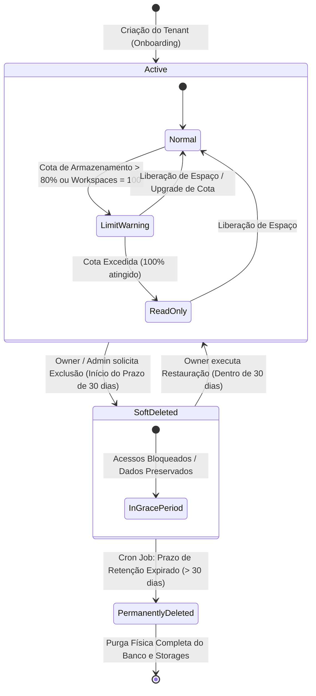
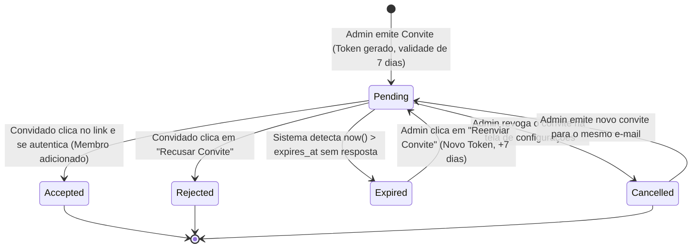
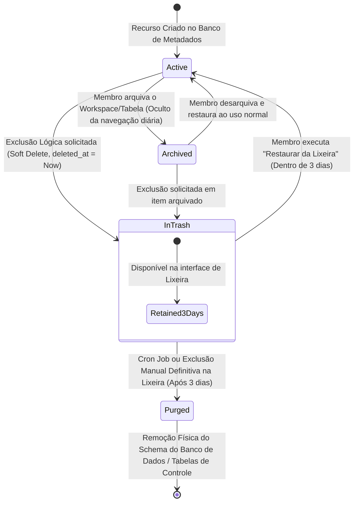
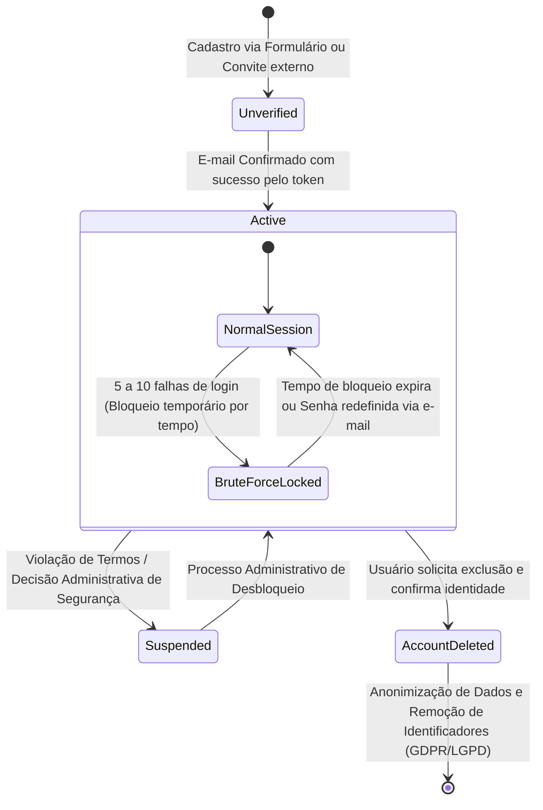

# Regras de Negócio e Especificação Arquitetural do Sistema — Dama Box

Este documento é a **fonte única de verdade (Single Source of Truth - SSOT)** e a "Constituição Técnica" para o comportamento, segurança, modelagem de domínio e autorização da plataforma **Dama Box**. Todas as implementações no Backend (API REST/FastAPI/SQLAlchemy), no Frontend (React/TypeScript) e na camada de Dados (PostgreSQL/Engines) **devem** obedecer rigorosamente às diretrizes e restrições aqui formalizadas.

---

## Índice

1. [Glossário de Termos do Domínio](#1-glossário-de-termos-do-domínio)
2. [Princípios e Diretrizes Arquiteturais](#2-princípios-e-diretrizes-arquiteturais)
3. [Ciclo de Vida e Regras por Entidade](#3-ciclo-de-vida-e-regras-por-entidade)
4. [Fluxos de Usuário Passo a Passo (User Flows)](#4-fluxos-de-usuário-passo-a-passo-user-flows)
5. [Casos de Uso Detalhados (Use Cases)](#5-casos-de-uso-detalhados-use-cases)
6. [Matrizes Formais de Autorização (RBAC + ACL)](#6-matrizes-formais-de-autorização-rbac--acl)
7. [Diagramas de Estado (Mermaid)](#7-diagramas-de-estado-mermaid)
8. [Regras de Consistência e Integridade do Banco de Dados](#8-regras-de-consistência-e-integridade-do-banco-de-dados)
9. [Eventos de Domínio (Domain Events)](#9-eventos-de-domínio-domain-events)
10. [Políticas de Auditoria, Versionamento e Lixeira (Time Travel)](#10-políticas-de-auditoria-versionamento-e-lixeira-time-travel)
11. [Arquitetura de Prontidão para IA (AI & Semantic Layer Readiness)](#11-arquitetura-de-prontidão-para-ia-ai--semantic-layer-readiness)
12. [Limites Operacionais e Cotas do Sistema](#12-limites-operacionais-e-cotas-do-sistema)

---

## 1. Glossário de Termos do Domínio

Para garantir a comunicação inequívoca (Linguagem Ubíqua do DDD) entre desenvolvedores, arquitetos, gestores e sistemas, definem-se os termos canônicos da plataforma:

| Termo | Definição Canônica no Dama Box |
| :--- | :--- |
| **Tenant (Inquilino)** | A instância lógica de isolamento no sistema, representada pela **Organização**. Todos os dados, usuários, cobranças e limites estão contidos no limite do Tenant. |
| **Organização (`Organization`)** | Entidade raiz do domínio que agrupa membros, define *Roles* organizacionais, detém a propriedade intelectual dos dados e responde por cotas de armazenamento. |
| **Workspace (Área de Trabalho)** | Um contêiner lógico de alto nível dentro de uma Organização, utilizado para segmentar departamentos, projetos ou contextos de negócios (ex: *Financeiro*, *Estoque*, *RH*). |
| **Dataset / Tabela Dinâmica** | A coleção estruturada de dados (metadados de colunas + registros materializados). No Dama Box, um arquivo importado (Excel/CSV) transforma-se em um Dataset vivo e relacional. |
| **Pasta (`Folder`)** | Elemento hierárquico organizacional que pode conter Tabelas e outras Pastas recursivamente dentro de um Workspace. |
| **RBAC (*Role-Based Access Control*)** | Controle de acesso baseado nos papéis organizacionais atribuídos aos membros (`Owner`, `Admin`, `Member`, `Guest`), conferindo permissões amplas de gestão. |
| **ACL Granular (*Access Control List*)** | Lista de controle de acesso específica e pontual aplicada em nível de recurso (Workspace, Pasta ou Tabela), permitindo conceder ou restringir permissões a usuários específicos ou grupos, sobrescrevendo as regras gerais. |
| **Camada Semântica (*Semantic Layer*)** | Enriquecimento de metadados das tabelas e colunas (sinônimos, descrições, tags, linhagem e relações conceituais) que confere significado de negócio aos dados brutos para consumo humano e por motores de Inteligência Artificial. |
| **Lineage (Linhagem de Dados)** | Rastreabilidade completa da origem e das transformações sofridas por um registro ou tabela desde sua importação inicial ou criação manual. |
| **Time Travel (Rollback)** | Capacidade do sistema de consultar e restaurar o estado de um registro ou da estrutura (schema) de uma tabela em um ponto específico do tempo passado (histórico retroativo). |
| **Soft Delete (Exclusão Lógica)** | Marcação de um registro ou entidade como excluída no banco de dados (`deleted_at IS NOT NULL`) sem a remoção física imediata, direcionando o item para a Lixeira. |

---

## 2. Princípios e Diretrizes Arquiteturais

A arquitetura do Dama Box é fundamentada nos seguintes mandamentos inegociáveis:

> [!IMPORTANT]
> **1. Isolamento Multi-Tenant Absoluto:** Todo acesso a dados, consultas SQL e transações no banco de dados **devem** ser explicitamente escopados por `id_org` (ID da Organização). Nenhuma requisição ou consulta pode, sob nenhuma hipótese, retornar registros de organizações diferentes.

> [!IMPORTANT]
> **2. Backend é a Única Fonte de Verdade para Segurança (Zero-Trust UI):** O Frontend nunca toma decisões finais de autorização. O ocultamento de botões ou telas na interface visual serve apenas à experiência do usuário (UX). Toda rota da API deve verificar a validade do Token JWT, o vínculo do usuário com a Organização e a autorização efetiva (RBAC + ACL) antes de executar qualquer operação de leitura ou escrita.

- **PostgreSQL como Single Source of Truth (SSOT):** O PostgreSQL relacional armazena tanto o banco de metadados (usuários, permissões, estruturas de tabelas) quanto os dados operacionais dinâmicos criados pelos usuários.
- **Trilha de Auditoria Inalterável:** Qualquer mutação em dados estruturais (schemas de tabelas, exclusões, alterações de permissão) ou registros operacionais deve gerar um evento de auditoria *append-only* (somente inserção).
- **Recuperação de Desastres e Prevenção de Perda:** Exclusões iniciadas por usuários nunca são exclusões físicas imediatas (Hard Delete). Todas as entidades principais transitam pela Lixeira por um período obrigatório de retenção.
- **Design API-First e Event-Driven:** Toda funcionalidade disponibilizada no Frontend consome a API REST documentada via OpenAPI/Swagger. A camada de serviços emite **Domain Events** para viabilizar integrações assíncronas e processamento analítico.

---

## 3. Ciclo de Vida e Regras por Entidade

### 3.1. Organização (`Organization`)
- **Identificação:** Toda Organização possui um identificador único universal (`UUIDv7`, que inclui ordenação temporal) e um nome fantasia (não necessariamente único no sistema).
- **Propriedade (Ownership):** 
  - Toda Organização deve possuir **exatamente um ou mais usuários com a Role de `Owner`** (Proprietário) em todos os momentos.
  - O último `Owner` de uma Organização não pode ser removido, rebaixado de cargo ou ter sua conta excluída sem antes transferir o *Ownership* para outro membro ativo da Organização.
- **Exclusão Administrativa:** A exclusão de uma Organização é um processo assíncrono. Ao solicitar a exclusão, a Organização entra em status `Soft Deleted`, bloqueando imediatamente novos acessos, uploads e consultas, permanecendo retida por **30 dias** até a remoção física definitiva (Purga) de todos os bancos de dados e volumes de armazenamento.

### 3.2. Usuários e Contas (`User`)
- **Identidade Única:** O cadastro exige um e-mail único em todo o sistema, um `username` exclusivo e uma senha forte.
- **Confirmação de E-mail:**
  - O e-mail deve ser confirmado via clique no link tokenizado enviado com validade de **24 horas**.
  - Enquanto não confirmado, a conta permanece no status `Unverified` com restrições de acesso (não pode criar novas Organizações, apenas aceitar convites de organizações existentes se o convite foi enviado ao e-mail exato cadastrado).
- **Gestão de Username e E-mail:**
  - Alterações no `username` são limitadas a **uma vez a cada 30 dias contínuos** para evitar abusos e falhas de auditoria.
  - Alterações de e-mail iniciam um processo de dupla verificação: um link de revogação é enviado ao e-mail antigo e um link de confirmação é enviado ao e-mail novo.
- **Segurança da Senha e Força Bruta:**
  - Requisitos de complexidade: mínimo de **12 caracteres**, contendo pelo menos uma letra maiúscula, uma minúscula, um número e um caractere especial.
  - Bloqueio progressivo de conta por falhas sucessivas de login de uma mesma conta ou IP:
    - 5 tentativas falhas: bloqueio por **15 minutos**.
    - 10 tentativas falhas: bloqueio por **1 hora** e envio de alerta de segurança por e-mail.
    - 15 tentativas falhas: bloqueio administrativo até redefinição de senha via verificação por e-mail.
- **Multi-vínculo:** Um único usuário pode ser membro de $N$ Organizações independentes, assumindo *Roles* diferentes em cada uma delas (ex: `Owner` na Org A e `Guest` na Org B). Pode ainda existir temporariamente sem nenhum vínculo organizacional (ex: recém-cadastrado).

### 3.3. Convites (`Invitation`)
- **Validade e Ciclo:** Um convite para entrar na Organização possui validade máxima de **7 dias corridos** a partir da data de emissão.
- **Regras de Envio:**
  - É vedado o envio de convite para um e-mail que já seja um membro ativo daquela mesma Organização.
  - Se um convite para o mesmo e-mail já estiver no status `Pending`, o reenvio atualiza a data de expiração para mais 7 dias e invalida o token criptográfico anterior.
- **Transições:** Podem assumir os estados `Pending` (Pendente), `Accepted` (Aceito), `Rejected` (Rejeitado pelo destinatário), `Cancelled` (Revogado pelo administrador) e `Expired` (Expirado pelo tempo).

### 3.4. Workspaces e Pastas (`Workspace` & `Folder`)
- **Escopo e Unicidade:**
  - Um Workspace pertence exclusivamente a **uma única Organização**.
  - O nome do Workspace deve ser **único dentro da mesma Organização**.
  - O nome de uma Pasta deve ser **única dentro do mesmo nível hierárquico** do Workspace (mesmo pai direct).
- **Limites e Hierarquia:**
  - Cota inicial de segurança: **máximo de 100 Workspaces por Organização** e **máximo de 100 Pastas por Workspace** (profundidade de aninhamento de pastas sugerida até 5 níveis para preservar performance de buscas na árvore).
- **Operações Estruturais:**
  - Workspaces podem ser duplicados. A duplicação de um Workspace clona todas as suas Pastas, Tabelas (apenas a estrutura de metadados ou estrutura + dados com chave de opção) e permissões de ACL Granular aplicáveis.

### 3.5. Tabelas, Colunas e Tipagem Dinâmica (`Table` & `Column`)
- **Limites de Contenção:** Limite inicial de **100 Tabelas por Workspace** para manter a performance de renderização no frontend e legibilidade arquitetural.
- **Suporte de Tipos de Dados:**
  - As colunas das tabelas dinâmicas suportam nativamente: `Text` (Texto Curto/Longo), `Integer` (Inteiro), `Decimal` (Numérico Exato com precisão configurável), `Boolean` (Verdadeiro/Falso), `DateTime` (Timestamp com Fuso Horário ISO-8601), `Date` (Data simples), `File` (Anexo/URI do MinIO ou S3), `Relation` (Chave Estrangeira relacional) e `Select` / `MultiSelect` (Lista finita de valores/tags definidas nos metadados da coluna).
- **Evolução de Schema (Schema Evolution):**
  - Renomear ou reordenar colunas modifica apenas os metadados no banco de controle do Dama Box; não exige alteração física destrutiva.
  - Alterações de tipo de dados (ex: `Text` para `Integer`) devem executar uma **validação assíncrona de compatibilidade de cast** de todas as linhas pré-existentes antes de efetivar a transação. Caso existam registros incompatíveis, o sistema bloqueia a alteração e retorna relatório de conflitos ao usuário.

### 3.6. Relacionamentos e Integridade Referencial (`Relationship`)
- **Cardinalidades:** A plataforma suporta conexões visuais de relacionamento entre Tabelas:
  - **1:1 (Um para Um)** e **1:N (Um para Muitos):** Mapeado diretamente via Chave Estrangeira (`FK`) na tabela de destino apontando para a Chave Primária (`PK`) da tabela de origem.
  - **N:N (Muitos para Muitos):** O Backend cria transparente e automaticamente uma **Tabela de Junção Intermediária** (Junction Table no PostgreSQL) oculta da árvore de navegação principal, mas acessível no gráfico visual de relacionamentos.
- **Proteção contra Dependências Circulares:** A validação do diagrama de relacionamentos no Backend impede grafos circulares fechados que gerem condições de corrida ou deadlocks em consultas em cascata.
- **Comportamento na Exclusão (On Delete):**
  - Quando um relacionamento (vínculo conceitual entre tabelas) é excluído na interface visual, **nenhum registro materializado nas tabelas de dados é apagado**. O sistema converte a coluna de relacionamento na tabela destino em uma coluna estática de tipo `Text` ou `Integer`, preservando o valor histórico sem quebrar as planilhas do usuário.

---

## 4. Fluxos de Usuário Passo a Passo (User Flows)

Os fluxos a seguir representam as sequências comportamentais obrigatórias entre Ator, Interface (Frontend) e Backend.

### UF01: Fluxo de Cadastro e Confirmação de E-mail
1. **Ator:** Acessa a Tela de Login e seleciona a opção "Criar nova conta".
2. **Frontend:** Exibe formulário solicitando `E-mail`, `Username` e `Senha` (com barra de força da senha em tempo real).
3. **Ator:** Preenche os dados e submete.
4. **Backend:**
   - Valida regras de complexidade da senha, formato de e-mail e verifica unicidade prévia de `E-mail` e `Username`.
   - Gera hash da senha via algoritmo BCRYPT/ARGON2id com *salt* único.
   - Cria o registro em banco com status `Unverified`.
   - Gera um `VerificationToken` de alta entropia assinado criptograficamente (validade 24h).
   - Dispara serviço assíncrono de e-mail contendo o link de verificação.
5. **Frontend:** Redireciona para tela de agradecimento ("Verifique sua caixa de entrada").
6. **Ator:** Abre o e-mail e clica no link de confirmação `https://app.damabox.com/verify?token=XYZ...`.
7. **Backend:** Valida o token, altera o status da conta para `Active`, invalida o token utilizado e autentica o usuário emitindo JWT e Refresh Token.
8. **Frontend:** Redireciona o usuário recém-autenticado para a Tela de Onboarding / Criação da Primeira Organização.

### UF02: Fluxo de Autenticação e Login Seguro
1. **Ator:** Acessa a Tela de Login, insere credenciais (`E-mail` ou `Username` + `Senha`) e marca ou não "Lembrar usuário".
2. **Backend:**
   - Verifica se a conta ou IP não está em bloqueio de força bruta de segurança.
   - Recupera o usuário no PostgreSQL e verifica a hash da senha.
   - Se inválido: incrementa contador de falhas no Redis/banco e retorna `401 Unauthorized` genérico ("Credenciais inválidas").
   - Se válido: zera contador de falhas, atualiza o timestamp `last_login_at`.
   - Gera **Access Token JWT** assinado via RSA/ECDSA com validade curta (**10 minutos**), contendo no payload: `sub` (user_id), `orgs` (lista de organizações e roles) e `exp`.
   - Gera **Refresh Token** opaco de longa duração (**30 dias**, estendido se "Lembrar usuário" = true), calcula o hash SHA-256 e armazena apenas o hash no banco PostgreSQL atrelado à sessão do dispositivo.
   - Retorna o JWT no corpo da resposta JSON e o Refresh Token via cookie seguro `HttpOnly, Secure, SameSite=Strict`.
3. **Frontend:** Armazena o JWT na memória da aplicação (ou store Zustand) e carrega a Tela do Workspace.

### UF03: Fluxo de Criação de Organização (Onboarding)
1. **Ator:** Na tela inicial sem vínculo (ou ao clicar em "Criar Nova Organização" no seletor do topo), informa o `Nome da Organização`.
2. **Backend:**
   - Valida se o usuário tem permissão para criar organizações (conta no status `Active`).
   - Inicia uma **transação atômica** no PostgreSQL:
     - Cria o registro na tabela `organizations` com um novo `UUIDv7`.
     - Associa o usuário criador na tabela `organization_members` com a role de `Owner`.
     - Cria automaticamente um Workspace padrão denominado *"Principal"* ou *"Meu Workspace"*.
     - Cria a estrutura inicial de pastas no Workspace padrão.
   - Comita a transação e retorna os dados da nova organização com os tokens de autorização atualizados no JWT.
3. **Frontend:** Atualiza o contexto global e redireciona para o Workspace recém-criado.

### UF04: Fluxo de Convite e Aceitação de Novos Membros
1. **Ator (Owner ou Admin):** Acessa as Configurações da Organização > Membros, clica em "Convidar Membro", digita o `E-mail` e seleciona a `Role` (`Admin`, `Member` ou `Guest`).
2. **Backend:**
   - Verifica no JWT se o ator possui permissão de gerenciar membros na Organização atual.
   - Verifica se o e-mail não pertence a um membro já existente.
   - Cria o registro na tabela `invitations` com status `Pending`, expiração para `now() + 7 dias` e um token criptográfico único.
   - Envia e-mail transacional ao convidado com o link de aceitação e nome da organização convidadora.
3. **Ator (Convidado):** Clica no link de convite recebido no e-mail.
4. **Frontend / Backend:**
   - **Se o usuário já estiver logado com o mesmo e-mail:** O Backend vincula imediatamente o usuário à tabela `organization_members` com a role estipulada, altera o status do convite para `Accepted` e atualiza a sessão.
   - **Se o usuário não possuir conta:** O Frontend exibe uma tela simplificada de cadastro pré-preenchida com o e-mail convidado. Após definir a senha, a conta é ativada e o vínculo organizacional é criado na mesma transação.

### UF05: Fluxo de Criação de Workspace e Modelagem Visual de Tabela
1. **Ator:** No painel principal da Organização, clica no botão "+ Novo Workspace", informa o nome e seleciona um ícone/cor.
2. **Backend:** Valida o limite de Workspaces da Organização e cria o recurso em transação.
3. **Ator:** Dentro do Workspace, clica em "+ Nova Tabela" ou arrasta o elemento no Menu Flutuante.
4. **Frontend:** Abre o modal de definição de metadados da tabela e colunas (Tela de Criar/Editar Tabela).
5. **Ator:** Adiciona a coluna *"Nome do Produto"* (Tipo `Text`, `Not Null`), a coluna *"Preço Unitário"* (Tipo `Decimal`, `Default = 0.00`) e a coluna *"Data de Entrada"* (Tipo `Date`, `Default = Now`). Clica em "Criar Tabela".
6. **Backend:**
   - Valida os metadados e limites de tabelas do Workspace.
   - Executa no PostgreSQL (ou motor dinâmico configurado) a criação de duas estruturas:
     - Os registros de metadados no schema de catálogo (`table_definitions`, `column_definitions`).
     - A estrutura física da tabela relacional no schema do Tenant do cliente, ou cria a tabela particionada no modelo JSONB/EAV de alta performance de dados dinâmicos da plataforma.
   - Dispara o Domain Event `table.created`.
7. **Frontend:** Renderiza imediatamente a Tela de Visualização de Dados (planilha interativa) vazia e pronta para edição inline de registros.

---

## 5. Casos de Uso Detalhados (Use Cases)

### UC01: Transferir Propriedade da Organização
- **Ator Principal:** Usuário com cargo de `Owner` (Proprietário Atual).
- **Atores Secundários:** Membro de destino (Futuro Proprietário).
- **Pré-condições:**
  1. O Ator Principal está autenticado e logado no contexto da Organização alvo.
  2. O Membro de destino já existe e é um membro ativo da mesma Organização com status `Active`.
- **Fluxo Principal:**
  1. O Ator Principal acessa `Configurações da Organização` > `Avançado` e clica em *"Transferir Propriedade"*.
  2. O sistema exibe modal de aviso crítico alertando sobre a perda de privilégios exclusivos de proprietário, exigindo a seleção do Membro de destino em uma lista suspensa.
  3. O Ator Principal seleciona o membro de destino e digita sua própria senha de acesso para confirmar a transação de segurança.
  4. O Backend valida a senha do Proprietário Atual.
  5. O Backend executa uma transação atômica:
     - Atualiza a role do Membro de destino de `Admin`/`Member`/`Guest` para `Owner`.
     - Atualiza a role do Proprietário Atual de `Owner` para `Admin`.
     - Registra o evento de auditoria `org.ownership_transferred` no log imutável.
  6. O Backend invalida as sessões ativas de ambos os envolvidos, forçando renovação dos tokens JWT com as novas permissões.
  7. O Frontend exibe notificação de sucesso e re-renderiza a interface aplicando as restrições da nova role de `Admin` ao usuário atual.
- **Fluxos Alternativos / Exceções:**
  - *EX01: Senha incorreta informada no passo 3.* O sistema rejeita a operação, emite alerta de segurança logado e exibe mensagem de erro na interface sem alterar nenhuma permissão.
  - *EX02: Membro destino está inativo ou suspenso.* A transação é abortada e uma notificação informa que a propriedade só pode ser transferida a usuários com conta ativa.
- **Pós-condições:** A Organização possui o novo membro com poderes absolutos de `Owner`. O antigo proprietário mantém acesso administrativo como `Admin`.

### UC02: Importar Dataset via Planilha Excel com Inferência de Tipos
- **Ator Principal:** Usuário com role `Owner`, `Admin` ou `Member` com permissão no Workspace.
- **Pré-condições:** O Workspace tem espaço em disco disponível na cota de 3GB do usuário/organização.
- **Fluxo Principal:**
  1. Na Tela do Workspace, o Ator clica em *"Importar Planilha / Dataset"*.
  2. O Ator arrasta e solta um arquivo `.xlsx` (Excel) com 5.000 linhas de histórico de vendas na zona de drop.
  3. O Frontend faz o upload temporário de verificação e solicita ao Backend o parse preliminar das primeiras 50 linhas para geração do **Preview Dinâmico**.
  4. O Backend utiliza motor de análise (ex: `Pandas` / `Polars` / `PyArrow`) para ler o arquivo, normalizar o encoding e executar o algoritmo de **Inferência Automática de Tipos**:
     - Colunas com apenas números inteiros são mapeadas como `Integer`.
     - Colunas contendo caracteres de formatação monetária ou casas decimais mapeiam como `Decimal`.
     - Colunas contendo textos curtos repetitivos (menos de 20 valores únicos em 5.000 linhas) são automaticamente sugeridas como `Select` (Categoria/Tag).
     - Colunas com datas em formatos padronizados tornam-se `Date` ou `DateTime`.
  5. O Frontend exibe a pré-visualização de tipos na tela. O Ator revisa, altera manualmente o tipo da coluna *"código_produto"* de `Integer` para `Text` (para não perder zeros à esquerda) e clica em *"Confirmar Importação"*.
  6. O Backend cria a nova tabela no catálogo do Dama Box e insere os 5.000 registros em lotes otimizados (*bulk insert* transacional via SQLAlchemy 2.0).
  7. O sistema calcula indicadores de qualidade iniciais (ex: % de células vazias por coluna) e disponibiliza a tabela pronta para navegação.
- **Pós-condições:** Um novo Dataset vivo é criado com tipagem forte no banco de dados, mantendo linhagem (`lineage`) indicando o nome do arquivo original importado e timestamp de criação.

### UC03: Compartilhar Tabela via ACL Granular com Permissão Diferenciada
- **Ator Principal:** Criador da tabela ou membro `Admin` / `Owner`.
- **Ator Destinatário:** Membro que possui apenas a role `Guest` (visualizador) na Organização como um todo.
- **Pré-condições:** O Ator Destinatário precisa ter capacidade de edição apenas em uma tabela específica de fechamento diário, sem ter acesso aos demais dados do Workspace.
- **Fluxo Principal:**
  1. Na Tela de Visualização da Tabela *"Fechamento de Caixa Diário"*, o Ator Principal clica no ícone de compartilhamento / cadeado (`ACL da Tabela`).
  2. O sistema exibe o painel de ACL Granular listando as permissões atuais herdadas da Organização.
  3. O Ator clica em *"Adicionar Exceção de Acesso"*, busca o nome do Ator Destinatário e seleciona a permissão explícita de **`Edit Data` (Pode Editar Registros)**.
  4. O Backend salva a regra na tabela de resolução `access_control_lists`, vinculando `id_table`, `id_user` e `permission_level = 'EDITOR'`.
  5. Quando o Ator Destinatário (`Guest` na Org) acessa a plataforma, sua visualização do Workspace oculta todas as tabelas em que ele não tem acesso, mostrando apenas a tabela *"Fechamento de Caixa Diário"*.
  6. Ao abrir a tabela, as células estão liberadas para **Edição Inline** (diferente da sua permissão padrão que seria somente leitura). No entanto, os botões de "+ Nova Coluna", "Excluir Tabela" e "Modificar Tipagem" permanecem ocultos e bloqueados pelo Backend.
- **Pós-condições:** A ACL Granular da tabela atua com precisão cirúrgica sobrescrevendo a limitação de leitura da Role organizacional para o recurso específico.

### UC04: Reverter Registro para Versão Anterior (Time Travel / Rollback)
- **Ator Principal:** Usuário com permissão de leitura/escrita na Tabela.
- **Pré-condições:** Um registro importante foi alterado incorretamente nas últimas horas ou dias.
- **Fluxo Principal:**
  1. Na Tela de Visualização de Dados, o Ator clica no menu de ações de uma linha (registro) específica e seleciona *"Ver Histórico de Alterações"*.
  2. O Backend consulta a tabela de auditoria/versionamento de dados (`record_version_history`) filtrando pelo `record_id` do item selecionado.
  3. O Frontend exibe um painel lateral em formato de *timeline*, mostrando uma lista cronológica de edições dos últimos 30 dias com marcação clara via diff (ex: Coluna *"Status"* alterada de `Em Processamento` para `Cancelado` por *João Silva* às *14:22*).
  4. O Ator localiza a versão correta de 2 dias atrás e clica no botão *"Reverter para esta Versão (Rollback)"*.
  5. O Backend abre uma transação, lê os valores consolidados daquele snapshot histórico, aplica o update na tabela operacional principal e gera um **novo evento de versionamento**, registrando que os dados foram restaurados via Time Travel a partir da versão $X$.
  6. A interface da planilha é atualizada instantaneamente com os dados recuperados na célula correspondente.
- **Pós-condições:** O registro volta exatamente ao estado passado desejado sem que a trilha de auditoria sequencial seja corrompida.

---

## 6. Matrizes Formais de Autorização (RBAC + ACL)

O sistema utiliza controle em duas camadas complementares: **RBAC Organizacional** (papel geral na empresa) e **ACL Granular por Recurso** (exceções pontuais em pastas ou tabelas).

### 6.1. Matriz de Permissões Organizacionais (RBAC)

| Categoria da Operação | Ação (`resource:action`) | `Owner` (Proprietário) | `Admin` (Administrador) | `Member` (Membro Padrão) | `Guest` (Visualizador) |
| :--- | :--- | :---: | :---: | :---: | :---: |
| **Organização** | `org:update_settings` (Alterar nome, logo, configurações) | ✅ | ✅ | ❌ | ❌ |
| | `org:transfer_ownership` (Transferir propriedade) | ✅ | ❌ | ❌ | ❌ |
| | `org:delete` (Exclusão da organização via Soft Delete) | ✅ | ❌ | ❌ | ❌ |
| | `org:view_audit_logs` (Visualizar trilha de auditoria global) | ✅ | ✅ | ❌ | ❌ |
| **Membros e Convites** | `member:invite` (Convidar novos usuários para a Org) | ✅ | ✅ | ❌ | ❌ |
| | `member:remove` (Remover membros ou revogar convites) | ✅ | ✅* | ❌ | ❌ |
| | `member:change_role` (Alterar role de outros membros) | ✅ | ✅** | ❌ | ❌ |
| **Workspaces e Pastas**| `workspace:create` (Criar novos Workspaces e Pastas) | ✅ | ✅ | ✅ | ❌ |
| | `workspace:update` (Renomear, arquivar ou mover Workspaces) | ✅ | ✅ | ✅*** | ❌ |
| | `workspace:delete` (Enviar Workspace para a Lixeira) | ✅ | ✅ | ✅*** | ❌ |
| **Tabelas e Estrutura** | `table:create` (Criar nova tabela, importar datasets Excel) | ✅ | ✅ | ✅ | ❌ |
| | `table:alter_schema` (Criar colunas, alterar tipos de dados, FKs) | ✅ | ✅ | ✅*** | ❌ |
| | `table:delete` (Enviar tabela para a Lixeira) | ✅ | ✅ | ✅*** | ❌ |
| **Manipulação de Dados**| `data:insert` (Criar novos registros/linhas nas tabelas) | ✅ | ✅ | ✅ | ❌ |
| | `data:update` (Edição inline de células na planilha) | ✅ | ✅ | ✅ | ❌ |
| | `data:delete` (Excluir linhas/registros e purgar do histórico) | ✅ | ✅ | ✅ | ❌ |
| | `data:view` (Leitura, visualização e exportação de planilhas)| ✅ | ✅ | ✅ | ✅ |
| **Arquivos e Anexos** | `file:upload` (Anexar arquivos a registros) | ✅ | ✅ | ✅ | ❌ |
| | `file:delete` (Remover arquivos dos buckets de storage) | ✅ | ✅ | ✅*** | ❌ |

> **Notas explicativas das regras de negócio:**
> - `*` *Admins podem remover Members e Guests, mas não podem remover nem rebaixar Owners ou outros Admins.*
> - `**` *Admins podem alterar cargos apenas de Members e Guests.*
> - `***` *Members possuem permissão total de alteração e exclusão apenas sobre Workspaces, Tabelas ou Arquivos **criados por eles mesmos**. Para recursos criados por outros membros, comportam-se conforme as permissões delegadas pela ACL Granular.*

### 6.2. Matriz de Resolução de Conflitos (RBAC vs. ACL Granular)

A autorização efetiva de um usuário em uma requisição para a API é avaliada em **tempo de execução pelo Backend** usando a seguinte lógica de precedência hierárquica e resolução de conflitos:

```text
[1º Nível] Role Organizacional do Usuário
   │
   ├─► Se for 'Owner' ou 'Admin': Acesso TOTAL concedido imediatamente (ACL não pode bloquear Owners/Admins).
   │
   └─► Se for 'Member' ou 'Guest': O Backend consulta a tabela de ACL Granular daquele Recurso Alvo.
          │
          ├─► Existe regra ACL EXPLÍCITA para este ID de Usuário na Tabela/Pasta?
          │      ├── SIM: A regra ACL SOBRESCREVE a permissão do RBAC (seja para amplificar ou restringir).
          │      └── NÃO: A permissão padrão do RBAC (Tabela acima) é aplicada como fallback.
```

> [!TIP]
> **Exemplo Prático de Resolução:** 
> - Se um usuário é `Member` no RBAC (que por padrão permite visualizar todas as tabelas), mas o `Owner` aplicou uma regra na ACL da *Tabela de Salários da Diretoria* marcando aquele usuário com `permission = DENY_ACCESS`, **o bloqueio explícito da ACL prevalece** e a tabela fica totalmente invisível para ele.
> - Se um usuário é `Guest` no RBAC (apenas leitura), mas recebeu ACL granular com permissão `EDITOR` em um Dataset específico, ele poderá **editar registros apenas naquela tabela**, permanecendo leitor no restante do sistema.

---

## 7. Diagramas de Estado (Mermaid)

Os diagramas abaixo ilustram formalmente como as entidades transitam entre seus estados no banco de dados do Dama Box, evitando inconsistências lógicas.

### 7.1. Diagrama de Estado da Organização (`Organization`)



### 7.2. Diagrama de Estado de Convite para Organização (`Invitation`)



### 7.3. Diagrama de Estado de Workspace e Tabelas (`Workspace` & `Table`)



### 7.4. Diagrama de Estado da Conta de Usuário (`User`)



---

## 8. Regras de Consistência e Integridade do Banco de Dados

Para garantir a escalabilidade e evitar degradação de performance em arquiteturas multi-tenant, o banco PostgreSQL relacional que suporta o Dama Box obedece a regras rígidas de modelagem física:

### 8.1. Chaves Primárias (`PK`) e Identificadores Universais
- Todas as entidades do banco de dados (Tabelas do sistema, Pastas, Workspaces, Usuários, Registros operacionais) utilizam obrigatoriamente **`UUID` na versão 7 (UUIDv7)** como Chave Primária.
- *Por que UUIDv7?* Diferente do UUIDv4 aleatório que degrada a fragmentação de índices B-Tree no PostgreSQL, o UUIDv7 embute os milissegundos do *timestamp* de criação em seus bits mais significativos, garantindo inserções sequenciais de alta performance idênticas às colunas auto-incrementais (BIGSERIAL), sem expor contagens sequenciais em URLs públicas ou APIs.

### 8.2. Políticas de Índices e Isolamento Multi-Tenant
- **Obrigatoriedade de Chave de Tenant em Toda Tabela:** Toda tabela de domínio no PostgreSQL (com exceção das tabelas globais como `users` ou `organizations`) deve possuir uma coluna obrigatória `id_org UUID NOT NULL REFERENCES organizations(id) ON DELETE CASCADE` ou `id_workspace UUID NOT NULL REFERENCES workspaces(id) ON DELETE CASCADE`.
- **Índices Compostos de Isolamento:** Nenhuma consulta no Backend pode realizar full table scans. Toda tabela que armazena dados de múltiplos usuários deve possuir um índice composto iniciando pela chave de isolamento:
  - Exemplo para a tabela de catálogo de colunas: `CREATE INDEX idx_col_definitions_org_workspace ON column_definitions (id_org, id_workspace, id_table);`
- **Chaves Únicas Compostas (Unique Constraints):** 
  - Nomes de Workspaces não são únicos no banco todo, mas devem ser únicos *por organização*: `CONSTRAINT uq_workspace_name_per_org UNIQUE (id_org, name, deleted_at)`. A inclusão do campo `deleted_at` na chave única permite que um Workspace seja recriado com o mesmo nome se o anterior estiver na Lixeira.

### 8.3. Modelo de Particionamento e Engines para Tabelas Dinâmicas
Para viabilizar a criação dinâmica de milhares de colunas com tipos arbitrários sem exceder o limite rígido de colunas do PostgreSQL (máximo de 1.600 colunas físicas por tabela e travamentos de *lock* em comandos `ALTER TABLE` em produção), o Backend do Dama Box adota uma arquitetura híbrida de dados:
1. **Schema per Workspace / Dedicated Tables (Para Datasets até 100 colunas):** O sistema gera tabelas reais no PostgreSQL em esquemas isolados (`CREATE TABLE org_xyz.tb_vendas_abc (...)`), aproveitando tipagem forte nativa, índices otimizados e relacionamentos com integridade física via Foreign Keys.
2. **Modelo Híbrido JSONB / EAV (Para Datasets Ultra-Dinâmicos ou com > 100 colunas):** O sistema armazena os registros em uma tabela central de alta escalabilidade particionada por `id_org` e `id_table`:
   ```sql
   CREATE TABLE dynamic_records (
       id UUID PRIMARY KEY,
       id_org UUID NOT NULL REFERENCES organizations(id),
       id_table UUID NOT NULL REFERENCES table_definitions(id),
       created_at TIMESTAMPTZ DEFAULT CURRENT_TIMESTAMP,
       updated_at TIMESTAMPTZ DEFAULT CURRENT_TIMESTAMP,
       created_by UUID REFERENCES users(id),
       is_deleted BOOLEAN DEFAULT FALSE,
       deleted_at TIMESTAMPTZ,
       data JSONB NOT NULL -- Armazena {"col_id_1": "Valor Texto", "col_id_2": 150.50, "col_id_3": true}
   ) PARTITION BY HASH (id_org);
   ```
   - O Backend utiliza índices `GIN (data jsonb_path_ops)` para garantir buscas instantâneas e ordenação ultrarrápida dentro das planilhas virtuais do usuário.

### 8.4. Padrão Universal de Exclusão Lógica (Soft Delete)
- É proibido executar comandos `DELETE FROM tabela WHERE ...` em fluxos normais da API.
- Todas as tabelas transacionais devem implementar as colunas de controle:
  - `is_deleted BOOLEAN NOT NULL DEFAULT FALSE`
  - `deleted_at TIMESTAMPTZ NULL DEFAULT NULL`
  - `deleted_by UUID NULL REFERENCES users(id)`
- O ORM (SQLAlchemy 2.0 / Alembic) deve ser interceptado via **Global Query Filters** para injetar automaticamente a condição `WHERE is_deleted = FALSE` em todas as leituras da API, isolando dados excluídos na Lixeira sem que os desenvolvedores precisem escrever essa cláusula manualmente em todo repositório.

---

## 9. Eventos de Domínio (Domain Events)

Para suportar o design assíncrono, webhooks, desacoplamento de serviços e futuras integrações, a camada de serviços do Dama Box emite eventos padronizados no padrão **CloudEvents 1.0 JSON** através de um barramento interno (In-Memory Pub/Sub ou Redis Streams).

### 9.1. Catálogo Oficial de Eventos do Domínio

| Nome do Evento (`type`) | Entidade Alvo | Momento do Disparo | Uso Principal |
| :--- | :--- | :--- | :--- |
| `damabox.org.created` | `Organization` | Após commit da criação de nova Organização | E-mail de boas-vindas, aprovisionamento inicial de storage S3 |
| `damabox.org.deleted` | `Organization` | Após alteração de status para `Soft Deleted` | Cancelamento de cobrança, alerta administrativo |
| `damabox.user.invited` | `Invitation` | Ao emitir um novo convite por e-mail | Disparo do e-mail transacional de convite via worker |
| `damabox.workspace.created` | `Workspace` | Após criação de Workspace no banco | Rastreamento de métricas de uso do Tenant |
| `damabox.table.schema_changed` | `Table` | Ao adicionar, remover, renomear ou tipar colunas | Invalidação de cache de TanStack Query, re-indexação da Camada Semântica IA |
| `damabox.data.record_inserted` | `Record` | Ao inserir novos dados em massa ou via form | Atualização do timestamp de última modificação da tabela, disparo de regras de validação |
| `damabox.data.record_updated` | `Record` | Ao editar célula inline com sucesso | Gravação no log imutável de Time Travel (auditoria) |
| `damabox.data.record_deleted` | `Record` | Ao excluir linha (Soft Delete) | Atualização de cotas e contadores de registros |
| `damabox.file.uploaded` | `File` | Após finalização de upload com sucesso | Processamento assíncrono de OCR em PDFs ou miniatura de imagens |

### 9.2. Exemplos de Payloads JSON Padronizados

#### Exemplo 1: Evento de Alteração de Estrutura de Tabela (`damabox.table.schema_changed`)
```json
{
  "specversion": "1.0",
  "id": "evt_01j23k4l5m6n7p8q9r0s1t2u3v",
  "source": "https://api.damabox.com/v1/workspaces/wks_01h98g7f6e5d4c3b2a1/tables/tbl_998877665544",
  "type": "damabox.table.schema_changed",
  "datacontenttype": "application/json",
  "time": "2026-07-07T18:35:00.123Z",
  "subject": "tbl_998877665544",
  "tenantid": "org_554433221100",
  "actor": {
    "user_id": "usr_112233445566",
    "username": "davi.silva",
    "role": "Owner",
    "ip_address": "192.168.1.100"
  },
  "data": {
    "workspace_id": "wks_01h98g7f6e5d4c3b2a1",
    "table_id": "tbl_998877665544",
    "table_name": "Estoque de Hardware 2026",
    "change_type": "COLUMN_ADDED",
    "column_details": {
      "column_id": "col_aaabbbccc111",
      "column_name": "Número de Série",
      "data_type": "Text",
      "is_nullable": false,
      "default_value": "N/A"
    },
    "version_number": 4
  }
}
```

#### Exemplo 2: Evento de Atualização de Registro para Auditoria (`damabox.data.record_updated`)
```json
{
  "specversion": "1.0",
  "id": "evt_01j99x8w7v6u5t4s3r2q1p0o9n",
  "source": "https://api.damabox.com/v1/tables/tbl_998877665544/records/rec_777888999000",
  "type": "damabox.data.record_updated",
  "datacontenttype": "application/json",
  "time": "2026-07-07T18:35:10.456Z",
  "subject": "rec_777888999000",
  "tenantid": "org_554433221100",
  "actor": {
    "user_id": "usr_112233445566",
    "username": "davi.silva"
  },
  "data": {
    "table_id": "tbl_998877665544",
    "record_id": "rec_777888999000",
    "changes": [
      {
        "column_id": "col_price_unit_id",
        "column_name": "Preço Unitário",
        "old_value": 1450.00,
        "new_value": 1590.00
      },
      {
        "column_id": "col_status_id",
        "column_name": "Status em Estoque",
        "old_value": "Baixo Estoque",
        "new_value": "Normal"
      }
    ]
  }
}
```

---

## 10. Políticas de Auditoria, Versionamento e Lixeira (Time Travel)

A confiança nos dados (Design Principle #5) e a segurança jurídica em ambientes de equipe exigem rastreabilidade integral sobre tudo o que acontece na plataforma.

### 10.1. Trilha de Auditoria Imutável (`Audit Logs`)
- **Quem pode acessar:** A visualização da Tela de Auditoria / Histórico é restrita exclusivamente a usuários com cargo de **`Owner` ou `Admin`** da Organização.
- **O que é capturado:** Toda ação que modifique estado no banco de dados gera um registro na tabela `audit_logs`:
  - Login bem-sucedido e falhas de autenticação.
  - Criação, exclusão e alteração de Workspaces, Pastas e Tabelas.
  - Modificação em cargos de membros e envio/cancelamento de convites.
  - Exportação em massa de dados de uma tabela para Excel/CSV (prevenção de exfiltração de dados).
- **Retenção e Imutabilidade:**
  - Os logs de auditoria possuem um período de retenção garantido de **no mínimo 30 dias contínuos**.
  - A tabela de auditoria no PostgreSQL deve ter permissões restritas a nível de usuário de banco (`REVOKE UPDATE, DELETE ON audit_logs FROM app_user;`), operando estruturalmente como uma tabela *append-only* que só pode ser purgada pelo processo automatizado de manutenção de longo prazo.

### 10.2. Versionamento de Dados e Histórico (Time Travel)
- **Granularidade do Snapshot:** Ao contrário de sistemas que versionam a planilha inteira a cada salvamento (gerando gigabytes de redundância), o Dama Box implementa versionamento por **mudança diferencial no nível do registro (Row-Level Diffing)**.
- **Mecanismo de Captura:**
  - Toda edição inline executada em uma célula da planilha grava a versão anterior e a nova no registro de histórico (conforme demonstrado no evento de exemplo anterior).
  - A retenção do histórico operacional de Time Travel para reversão pontual de células ou linhas é mantida por **30 dias**.
- **Rollback Estrutural de Schema:**
  - Se um usuário acidentalmente reordenar ou deletar uma coluna importante, o sistema preserva os metadados históricos de schema das tabelas.
  - O comando de "Restaurar Estrutura Anterior" recria a coluna deletada e re-vincula os dados históricos correspondentes que permaneciam salvos na camada estática de Time Travel, sem impacto em novas colunas que tenham sido adicionadas posteriormente.

### 10.3. Funcionamento e Rotina de Limpeza da Lixeira (`Trash Bin`)
- **Separação de Lixeiras:**
  - **Lixeira de Estruturas (Workspaces, Pastas e Tabelas):** Os itens deletados na interface permanecem na Lixeira com visualização e opção de restauração instantânea por **3 dias corridos**.
  - **Lixeira de Organizações Inteiras:** Uma organização deletada aguarda na lixeira administrativa por **30 dias corridos** devido a questões jurídicas e financeiras.
- **Rotina de Purga Automatizada:**
  - Um *Cron Job* executado assincronamente pelo Backend (via Celery ou NestJS Schedule) roda diariamente durante a janela de manutenção de madrugada (`03:00 AM UTC`).
  - A rotina localiza todos os itens na tabela onde `is_deleted = TRUE` e `now() - deleted_at > INTERVAL '3 DAYS'` (ou 30 dias para Orgs) e executa a exclusão em cascata real no banco de dados (`HARD DELETE`), liberando espaço no banco relacional e excluindo os arquivos vinculados nos buckets de armazenamento MinIO/S3.

---

## 11. Arquitetura de Prontidão para IA (AI & Semantic Layer Readiness)

O Dama Box não foi concebido apenas como um organizador visual de planilhas, mas como uma **Camada Semântica (Semantic Layer)** projetada para expor dados organizados, tipados e limpos para agentes autônomos e Modelos de Linguagem de Grande Escala (LLMs).

> [!TIP]
> **Visão de Produto:** Sucesso na era da Inteligência Artificial é quando um gestor conecta o Dama Box ao seu assistente de IA preferido e pergunta *"Qual foi a margem de lucro média dos produtos na tabela de Estoque no mês passado?"* e recebe uma resposta matemática exata em segundos, sem alucinações.

### 11.1. Enriquecimento do Catálogo de Dados para Contexto de LLMs
Para que um LLM consiga escrever consultas precisas ou gerar insights úteis sem precisar que o usuário envie milhões de tokens de dados brutos no prompt, a plataforma modela metadados semânticos profundos em cada entidade:

```sql
-- Exemplo conceitual da tabela de metadados da Camada Semântica
CREATE TABLE semantic_catalog_metadata (
    id UUID PRIMARY KEY,
    id_org UUID NOT NULL REFERENCES organizations(id),
    id_table UUID REFERENCES table_definitions(id),
    id_column UUID NULL REFERENCES column_definitions(id),
    business_description TEXT NOT NULL, -- Ex: "Faturamento líquido após impostos e devoluções."
    synonyms TEXT[] DEFAULT '{}',       -- Ex: '{"receita_liquida", "net_revenue", "faturamento"}'
    semantic_tags TEXT[] DEFAULT '{}',  -- Ex: '{"financeiro", "kpi_crítico", "confidencial"}'
    ai_guidance_notes TEXT,             -- Ex: "Para somar o total, ignore registros onde status='Cancelado'."
    last_updated_at TIMESTAMPTZ DEFAULT CURRENT_TIMESTAMP
);
```
- Sempre que uma coluna ou tabela é criada, a interface permite ao usuário (ou a um agente de IA em segundo plano) preencher a **Descrição de Negócio**, **Sinônimos** e **Notas de Orientação para IA**. Esse catálogo enxuto é o que será enviado no *System Prompt* (Context Window) de futuras integrações de linguagem natural.

### 11.2. Segurança e Isolamento Multi-Tenant em Consultas NL2SQL (*Natural Language to SQL*)
A futura integração da plataforma com motores NL2SQL (transformação de perguntas em linguagem natural para consultas SQL executadas no banco operacional) obedece a duas regras estritas de segurança de dados:

```text
[Usuário digita Pergunta no Chat de IA] 
              │
              ▼
[LLM Gera Consulta SQL Bruta com base no Catálogo Semântico] 
              │  Ex: SELECT SUM(valor) FROM tb_vendas WHERE ano = 2026;
              ▼
[Backend intercepta o SQL via Parser AST / SQLAlchemy] 
              │  INJEÇÃO OBRIGATÓRIA DE SEGURANÇA MULTI-TENANT
              ▼
[SQL Reescrito e Seguro]
                 Ex: SELECT SUM(valor) FROM tb_vendas WHERE ano = 2026 AND id_org = 'org_atual_do_jwt';
              │
              ▼
[Execução Read-Only no Banco Operacional e Retorno do Insight ao Usuário]
```

1. **Injeção Obrigatória de Escopo de Tenant:** O SQL gerado por um LLM **nunca** é executado diretamente contra o PostgreSQL. O Backend intercepta a string SQL, converte em uma Árvore Sintática Abstrata (AST via biblioteca de parsing de SQL) e **injeta de forma forçada e programática** a cláusula `AND id_org = :tenant_id_from_jwt` em cada bloco `FROM` e `JOIN`. Isso impossibilita que um ataque de engenharia de prompt (Prompt Injection) faça o LLM vazar dados de outros clientes.
2. **Conexão de Banco Exclusiva de Leitura (Read-Only User):** O motor de execução de NL2SQL conecta-se ao PostgreSQL utilizando um usuário de banco desprovido de privilégios de escrita (`GRANT SELECT ONLY ON ALL TABLES ...`). Tentativas do LLM de emitir comandos `DROP TABLE`, `UPDATE`, `INSERT` ou `ALTER` falham ao nível do SGBD com erro fatal imediato.

### 11.3. Detecção Assíncrona de Anomalias e Sugestões de Relacionamento
A arquitetura contempla *workers* assíncronos em segundo plano preparados para ler metadados semânticos e gerar valor proativo:
- **Sugestão Automática de Relacionamentos (Linkage Suggestion):** Ao importar uma nova tabela contendo uma coluna denominada *"ID do Cliente"* ou *"E-mail do Comprador"*, o motor semântico identifica que já existe um Dataset no Workspace chamado *"Cadastro de Clientes"* com chave primária homônima e sugere na interface visual: *💡 "Detectamos uma ligação com a tabela 'Cadastro de Clientes'. Deseja criar um Relacionamento 1:N agora?"*
- **Varredura de Consistência e Limpeza de Dados (Data Cleansing):** Tarefas assíncronas podem identificar registros anômalos em planilhas importadas (ex: uma coluna formatada como `Decimal` onde 99% das linhas possuem valores em torno de `100.00`, mas uma linha possui o valor `1000000.00`, ou detecção de datas no futuro para datas de nascimento) e destacar visualmente as células na interface como *⚠️ "Anomalia Detectada pela IA — Revisar valor"*.

---

## 12. Limites Operacionais e Cotas do Sistema

Para garantir que o sistema não sofra com degradação de recursos (ataques de negação de serviço por exaustão de armazenamento ou memória), os limites operacionais iniciais são tabelados e fiscalizados ativamente em todas as camadas de controle da API:

| Recurso / Entidade | Limite Operacional Oficial | Comportamento ao Atingir o Limite |
| :--- | :---: | :--- |
| **Workspaces por Organização** | **100 Workspaces** | Bloqueio de criação na API (`400 Bad Request`). Solicitação de arquivamento de Workspaces antigos ou upgrade de plano. |
| **Pastas por Workspace** | **100 Pastas** | Bloqueio do botão "+ Nova Pasta". Orientação de reestruturação hierárquica. |
| **Tabelas por Workspace** | **100 Tabelas** | Bloqueio de criação ou importação de novas tabelas naquele Workspace específico. |
| **Colunas por Tabela** | **200 Colunas** | Bloqueio de adição de colunas para preservar performance de renderização no TanStack Table e limites do banco. |
| **Registros por Importação (Excel/CSV)** | **50.000 Registros por arquivo** | Arquivos maiores devem ser fracionados ou importados através de rotina de *streaming* por lotes em segundo plano. |
| **Tamanho Máximo por Arquivo (Upload)** | **50 MB por arquivo** | Rejeição no *handshake* do upload. Suporte a vídeos curtos, planilhas pesadas, PDFs e imagens em alta resolução. |
| **Cota de Armazenamento de Arquivos** | **3 GB por Usuário** | A soma dos tamanhos físicos de todos os anexos no MinIO/S3 vinculados às tabelas do usuário/org não pode exceder 3 GB no plano inicial. O sistema emite alerta visual na cor âmbar ao atingir 80% (2.4 GB) e bloqueia novos uploads ao atingir 100%. |
| **Rate Limit de Autenticação (Login/API)** | **60 requisições / minuto por IP** | Retorno de código HTTP `429 Too Many Requests` com cabeçalho de contagem regressiva para liberação (`Retry-After`). |
| **Retenção de Lixeira (Estruturas)** | **3 Dias corridos** | Após o prazo, o item é removido do banco pelo *Cron Job* noturno inegociavelmente. |
| **Retenção de Trilha de Auditoria / Time Travel** | **30 Dias corridos** | Histórico operacional superior a 30 dias é compactado e arquivado (ou excluído no plano padrão). |

---

## Conclusão e Governança deste Documento

Qualquer alteração em requisitos funcionais, criação de novos tipos de dados, alteração nos prazos de retenção da lixeira ou adição de endpoints que afetem a segurança multi-tenant **deve ser formalmente discutida e aprovada via Pull Request** atualizando primeiramente este documento de **Regras de Negócio (`regras_de_negocio.md`)**, antes de qualquer linha de código ser modificada em `backend/` ou `frontend/`.

*O Dama Box é construído com rigor arquitetural para ser seguro, rápido, compreensível para humanos e pronto para o futuro da Inteligência Artificial.*